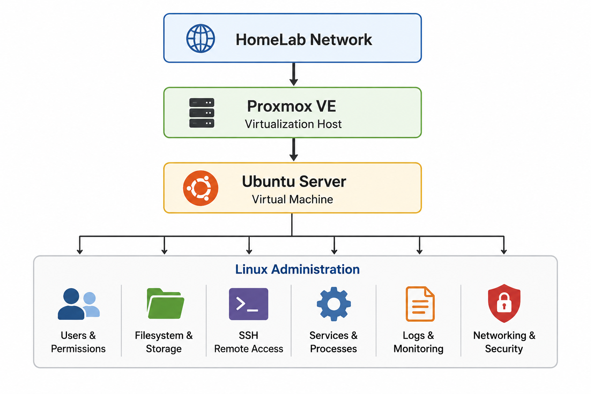

# Linux Administration

> Part 3 of the IT-HomeLab Series
>
> This repository documents my Linux Administration journey in a practical HomeLab environment. The project focuses on Ubuntu Server, Linux system administration, remote management, services, networking, security, and troubleshooting.

> **Note:** This repository covers **Part 3 – Linux Administration**. Docker and advanced Linux operations are covered in the following projects of the IT-HomeLab Series.

---

## Table of Contents

* [Project Overview](#project-overview)
* [Project Objectives](#project-objectives)
* [Technology Stack](#technology-stack)
* [Hardware & Environment](#hardware--environment)
* [Architecture](#architecture)
* [Project Roadmap](#project-roadmap)
* [Project Timeline](#project-timeline)
* [Next Projects](#next-projects)
* [IT-HomeLab Series](#it-homelab-series)
* [License](#license)

---

# Project Overview

This repository is the third project in my IT-HomeLab Series.

The goal of this project is to build practical Linux system administration skills using Ubuntu Server in my HomeLab environment.

Instead of only installing Linux, I document the important steps of the process, including planning, configuration, testing, troubleshooting, and lessons learned.

The project focuses on the skills that are commonly used by Linux System Administrators and IT System Engineers, such as user and permission management, filesystem administration, SSH, package management, services, processes, logs, networking, and basic server security.

This repository is both a learning project and a technical portfolio. The goal is to build a realistic Linux environment while developing practical administration and troubleshooting skills.

---

# Project Objectives

The main goals of this project are to:

* Build and configure an Ubuntu Server environment.
* Understand the basic Linux filesystem and administration model.
* Manage users, groups, permissions, and ownership.
* Configure and use SSH for remote administration.
* Manage packages and software repositories.
* Understand and manage Linux services with systemd.
* Monitor processes, resources, and system logs.
* Configure and troubleshoot basic Linux networking.
* Apply basic Linux security and hardening practices.
* Practice structured troubleshooting instead of applying random fixes.
* Document important configuration steps, problems, solutions, and lessons learned.
* Build a GitHub portfolio that demonstrates practical Linux administration skills.

---

### Virtualization
- Proxmox VE

### Operating System
- Ubuntu Server

### Administration
- Users & Groups
- Permissions & Ownership
- Filesystem & Storage
- SSH
- Package Management
- systemd
- Processes & Logs
- Linux Networking

### Security
- UFW
- SSH Hardening
- User Privilege Management
- Security Updates

---

# Hardware & Environment

The Linux environment runs on the existing HomeLab infrastructure.

The physical HomeLab hardware and Proxmox VE environment were prepared in the previous HomeLab projects.

The Ubuntu Server is deployed as a virtual machine on Proxmox VE.

The available hardware resources are limited, so the Linux environment is designed with a focus on practical learning, efficient resource usage, and realistic administration scenarios.

---

# Architecture

The Linux environment is part of the larger IT-HomeLab infrastructure.

|Basic Structure |
|:--------------:|
||

The Ubuntu Server runs as a virtual machine on Proxmox VE and provides the foundation for the Linux Administration phases in this repository.

The Linux server will also become a foundation for the following Docker and Linux Operations projects.

---

# Project Roadmap

The project is divided into separate phases. Each phase focuses on one main topic and builds on the previous phases.

## Linux Administration

* ✅ [Phase 1 – Ubuntu Server Installation & Base Configuration](docs/1-Ubuntu-Server-Installation-Base-Configuration/README.md)
* ✅ [Phase 2 – Linux Users, Groups & Permissions](docs/2-Linux-Users-Groups-Permissions/README.md)
* ✅ [Phase 3 – Linux Filesystem & Storage Basics](docs/3-Linux-Filesystem-Storage-Basics/README.md)
* ✅ [Phase 4 - SSH & Remote Administration](docs/4-SSH-Remote-Administration/README.md)
* 🚧 Phase 5 – Package & Service Management
* ⏳ Phase 6 – Processes, Logs & Troubleshooting
* ⏳ Phase 7 – Linux Networking
* ⏳ Phase 8 – Linux Security & Hardening

> **Project Status:** 🚧 In Progress

The phases will be completed step by step. New phases will be linked here as they are completed.

---

# Project Timeline

This timeline shows the main milestones of the project.

| Date | Milestone |
|------|-----------|
| 17-08-2026 | GitHub repository created |
| 17-08-2026 | Phase 1 – Ubuntu Server Installation & Base Configuration completed |
| 22-08-2026 | Phase 2 – Linux Users, Groups & Permissions completed |
| 26-08-2026 | Phase 3 – Linux Filesystem & Storage Basics completed |
| 31-08-2026 | Phase 4 - SSH & Remote Administration completed |

The timeline will be updated as the project progresses.

---

# Next Projects

## Part 4 – Docker & Containers

After completing the Linux Administration project, the next part of the HomeLab Series will focus on Docker and container technologies.

The planned topics include:

* Docker Engine
* Images & Containers
* Container Lifecycle
* Volumes
* Docker Networking
* Docker Compose
* Portainer
* Containerized Services
* Multi-Container Applications

The Linux Administration skills developed in this repository will provide the foundation for the Docker environment.

## Part 5 – Linux Operations

The following project will focus on operating and maintaining Linux infrastructure.

Planned topics include:

* Advanced Networking
* Security & Hardening
* Storage Management
* Backup & Restore
* Monitoring
* Logging & Alerting
* Operational Troubleshooting

These topics will build on the Linux and Docker knowledge developed in the previous projects.

---

# IT-HomeLab Series

This repository is part of my **IT-HomeLab Series**.

Each repository focuses on a different area of IT infrastructure while remaining connected to the same HomeLab environment.

| Status | Part   | Repository                                                                                             |
| ------ | ------ | ------------------------------------------------------------------------------------------------------ |
| ✅      | Part 1 | [IT-HomeLab-Windows-Infrastructure](https://github.com/ali-turkoglu/IT-HomeLab-Windows-Infrastructure) |
| ✅     | Part 2 | [IT-HomeLab-Cloud-Identity](https://github.com/ali-turkoglu/IT-HomeLab-Cloud-Identity) (Core topics completed; Exchange Server pending)                 |
| 🚧     | Part 3 | IT-HomeLab-Linux-Administration (Current Repository)                                                   |
| ⏳      | Part 4 | IT-HomeLab-Docker-Containers                                                                           |
| ⏳      | Part 5 | IT-HomeLab-Linux-Operations                                                                            |
| ⏳      | Part 6 | IT-HomeLab-Network-Security                                                                            |
| ⏳      | Part 7 | IT-HomeLab-Service-Management                                                                            |

Navigation: Use the repository links above to move between the different parts of the IT-HomeLab Series.

The series will continue as I build, test, troubleshoot, and document more technologies in my HomeLab.

---

# License

This project is licensed under the MIT License.

See the [LICENSE](LICENSE) file for more information.
