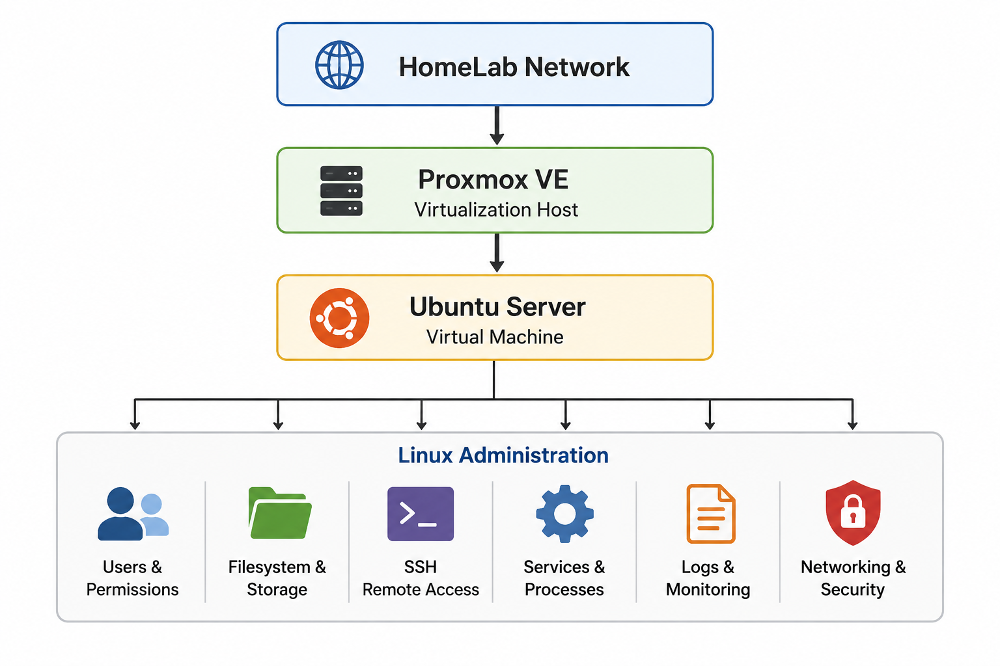

# Linux Administration

> Part 3 of the IT-HomeLab Series
>
> **Status:** ✅ Completed
>
> This repository documents my practical Linux administration work with Ubuntu Server, remote access, services, networking, security, and troubleshooting.

**Note:** This repository covers **Part 3 – Linux Administration**. Docker and Linux operations are the focus of the next two projects.

---

## Table of Contents

- [Project Overview](#project-overview)
- [Project Objectives](#project-objectives)
- [Technology Stack](#technology-stack)
- [Hardware & Environment](#hardware--environment)
- [Architecture](#architecture)
- [Project Roadmap](#project-roadmap)
- [Project Timeline](#project-timeline)
- [Next Projects](#next-projects)
- [IT-HomeLab Series](#it-homelab-series)
- [License](#license)

---

## Project Overview

This repository is the third part of my IT-HomeLab Series.

I installed and configured Ubuntu Server on the existing Proxmox environment to develop practical Linux administration skills.

The work included users and permissions, storage, SSH, packages, services, processes, logs, networking, and basic security. I also configured WireGuard for remote access and joined Ubuntu Server to the existing Active Directory domain.

The documentation records what I configured, tested, and troubleshot, together with selected screenshots and lessons learned.

---

## Project Objectives

The main goals were to:

- Install and configure Ubuntu Server.
- Understand the Linux filesystem and basic storage management.
- Manage users, groups, permissions, and ownership.
- Use SSH keys for remote administration.
- Manage packages with APT and dpkg.
- Manage services with systemd.
- Review processes, resource usage, and logs.
- Configure and troubleshoot basic networking.
- Set up secure remote access with WireGuard.
- Integrate Ubuntu Server with Active Directory.
- Review firewall rules, SSH settings, sudo permissions, and updates.
- Document configuration, testing, problems, and solutions.

---

## Technology Stack

| Area | Technologies |
|:---|:---|
| Virtualization | Proxmox VE |
| Operating System | Ubuntu Server |
| Remote Administration | OpenSSH, ED25519 keys |
| Package Management | APT, dpkg |
| Services & Logs | systemd, journalctl |
| Networking | Netplan, systemd-resolved |
| VPN | WireGuard |
| Firewall | nftables |
| Centralized Identity | Active Directory, realmd, SSSD |
| Automatic Updates | unattended-upgrades |

---

## Hardware & Environment

The Linux environment runs on the existing HomeLab infrastructure prepared in the previous projects.

| Component | Detail |
|:---|:---|
| Physical Host | Mini PC with AMD Ryzen 5 7430U, 16 GB RAM, and 512 GB SSD |
| Hypervisor | Proxmox VE |
| Linux VM | Ubuntu Server |
| VM Resources | 2 vCPU, 4 GB RAM, and 32 GB disk |
| Administration Device | MacBook |
| Existing Infrastructure | Windows Server with Active Directory and DNS |

The available resources are limited, so I kept the environment focused on practical administration tasks.

---

## Architecture

The Ubuntu Server is part of the same HomeLab as the Windows and Microsoft cloud projects.

| Basic Structure |
|:---:|
|  |

Ubuntu Server runs as a VM on Proxmox VE. It uses the existing internal DNS service and Active Directory identities. WireGuard provides remote access to the HomeLab.

This server will also provide the foundation for the planned Docker and Linux Operations work.

---

## Project Roadmap

The project was divided into phases. Each phase focused on one main topic and built on the previous work.

- ✅ [Phase 1 – Ubuntu Server Installation & Base Configuration](docs/1-Ubuntu-Server-Installation-Base-Configuration/README.md)
- ✅ [Phase 2 – Linux Users, Groups & Permissions](docs/2-Linux-Users-Groups-Permissions/README.md)
- ✅ [Phase 3 – Linux Filesystem & Storage Basics](docs/3-Linux-Filesystem-Storage-Basics/README.md)
- ✅ [Phase 4 – SSH & Remote Administration](docs/4-SSH-Remote-Administration/README.md)
- ✅ [Phase 5 – Package & Service Management](docs/5-Package-Service-Management/README.md)
- ✅ [Phase 6 – Processes, Logs & Troubleshooting](docs/6-Processes-Logs-Troubleshooting/README.md)
- ✅ [Phase 7 – Linux Networking](docs/7-Linux-Networking/README.md)
- ✅ [Phase 8 – WireGuard VPN & Secure Remote Access](docs/8-WireGuard-VPN-Secure-Remote-Access/README.md)
- ✅ [Phase 9 – Active Directory Integration & Centralized Authentication](docs/9-Active-Directory-Integration-Centralized-Authentication/README.md)
- ✅ [Phase 10 – Linux Security & Hardening](docs/10-Linux-Security-Hardening/README.md)

---

## Project Timeline

| Date | Milestone |
|:---|:---|
| 17-08-2026 | GitHub repository created |
| 17-08-2026 | Phase 1 – Ubuntu Server Installation & Base Configuration completed |
| 22-08-2026 | Phase 2 – Linux Users, Groups & Permissions completed |
| 26-08-2026 | Phase 3 – Linux Filesystem & Storage Basics completed |
| 31-08-2026 | Phase 4 – SSH & Remote Administration completed |
| 04-09-2026 | Phase 5 – Package & Service Management completed |
| 08-09-2026 | Phase 6 – Processes, Logs & Troubleshooting completed |
| 09-09-2026 | Phase 7 – Linux Networking completed |
| 21-09-2026 | Phase 8 – WireGuard VPN & Secure Remote Access completed |
| 29-09-2026 | Phase 9 – Active Directory Integration & Centralized Authentication completed |
| 03-10-2026 | Phase 10 – Linux Security & Hardening completed |

---

## Next Projects

### Part 4 – Docker & Containers

> **Status:** 🚧 In Progress — planning and preparation

The next part focuses on Docker and container management. I will use the Linux foundation from this repository to learn container administration and run selected services.

The planned phases are:

1. Docker Fundamentals & Installation
2. Docker Storage & Container Data
3. Docker Networking
4. Docker Compose
5. Container Management with Portainer
6. Web Service Containers
7. Database Containers
8. Real Multi-Container Application

### Part 5 – Linux Operations

> **Status:** ⏳ Planned

Part 5 will focus on operating and maintaining the Linux and container environment.

The planned phases are:

1. Network Operations & Troubleshooting
2. Security Operations & Maintenance
3. Storage Operations & Capacity Management
4. Backup, Restore & Recovery Validation
5. Monitoring & Service Health
6. Logging, Alerting & Incident Basics
7. Final Small Company Linux Operations Scenario

These topics will build on the work in Parts 3 and 4.

---

## IT-HomeLab Series

Each repository focuses on a different area of IT infrastructure. All parts belong to the same connected HomeLab environment.

| Status | Part | Repository |
|:---|:---|:---|
| ✅ Completed | Part 1 – Windows Infrastructure | [IT-HomeLab-Windows-Infrastructure](https://github.com/ali-turkoglu/IT-HomeLab-Windows-Infrastructure) |
| ✅ Completed | Part 2 – Cloud Identity & Microsoft 365 | [IT-HomeLab-Cloud-Identity](https://github.com/ali-turkoglu/IT-HomeLab-Cloud-Identity) |
| ✅ Completed | Part 3 – Linux Administration | IT-HomeLab-Linux-Administration (Current Repository) |
| 🚧 In Progress | Part 4 – Docker & Containers | IT-HomeLab-Docker-Containers |
| ⏳ Planned | Part 5 – Linux Operations | IT-HomeLab-Linux-Operations |

[Back to IT HomeLab Journey](https://github.com/ali-turkoglu/IT-HomeLab-Journey)

---

## License

This project is licensed under the MIT License.

See the [LICENSE](LICENSE) file for more information.
