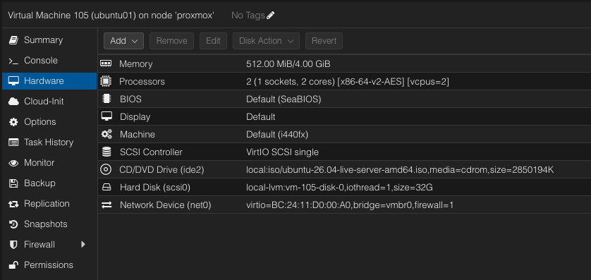
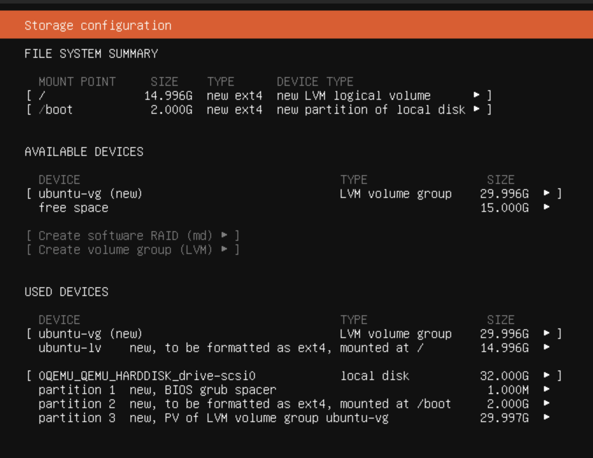
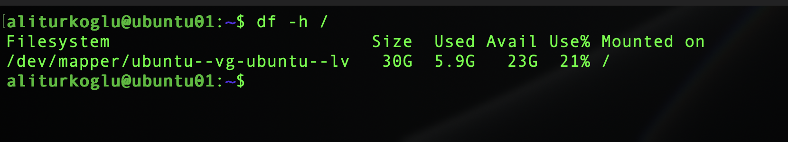
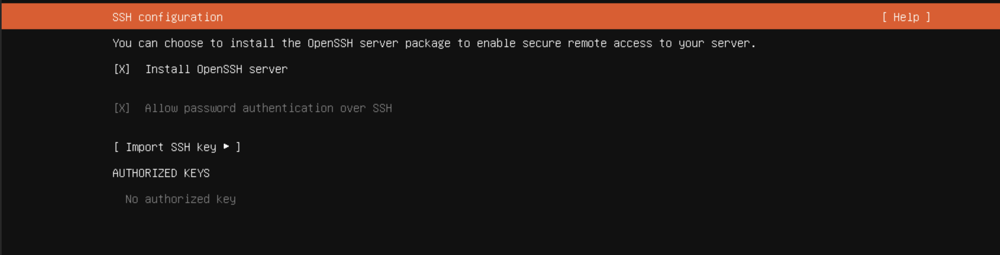
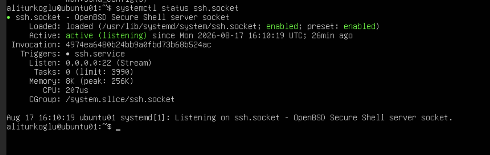
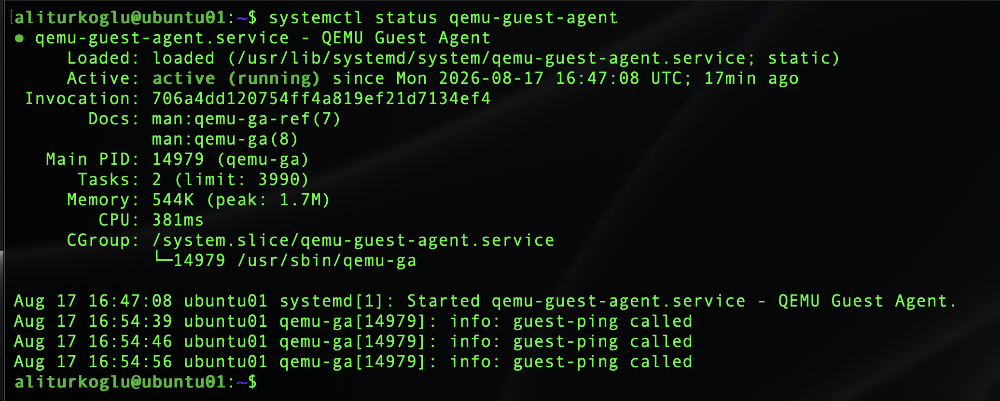
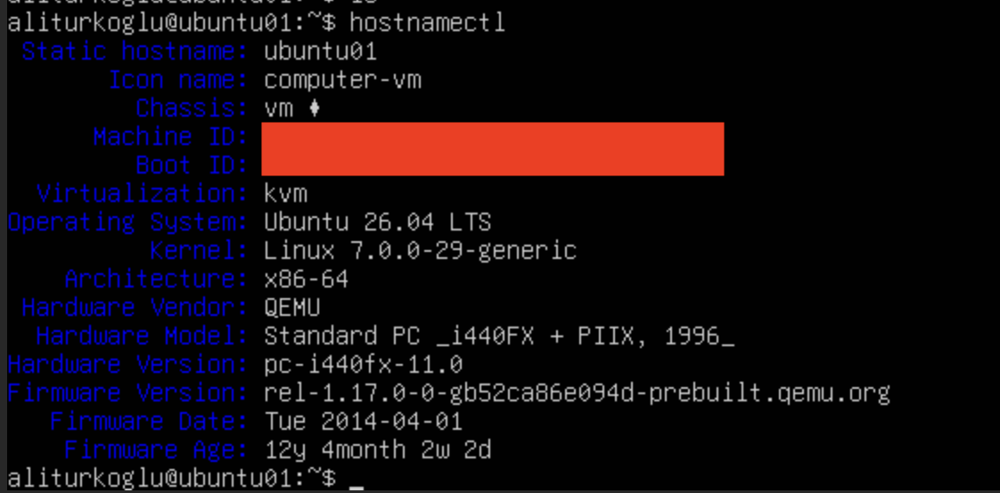
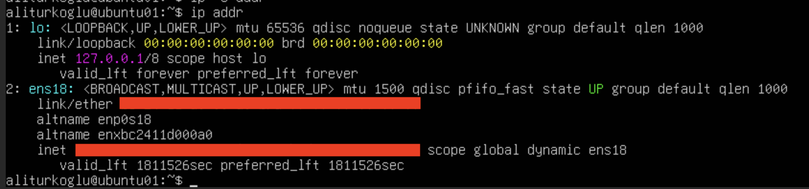
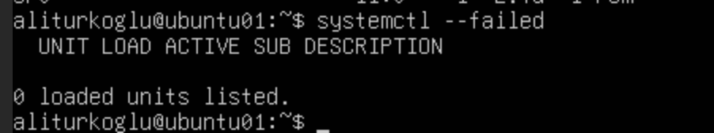

# Phase 1 – Ubuntu Server Installation & Base Configuration

## Purpose

The goal of this phase was to install Ubuntu Server as a virtual machine (VM) on Proxmox and prepare it as the foundational Linux server for my HomeLab. I configured the server with basic storage, networking, hostname, and SSH access.

## Objectives

- Create and configure the Ubuntu Server VM on Proxmox VE
- Install Ubuntu Server 26.04 LTS
- Configure and extend LVM (Logical Volume Manager) storage
- Set up a static IP, hostname, and disable IPv6
- Install and verify OpenSSH for remote management
- Install and verify the QEMU Guest Agent
- Perform initial system updates and timezone configuration
- Verify system health and service statuses

## Environment

- **Hypervisor:** Proxmox VE
- **Guest OS:** Ubuntu Server 26.04 LTS
- **Architecture:** x86-64
- **VM Resources:** 4 GB RAM, 2 CPU cores, 32 GB virtual disk
- **Network:** VirtIO (Static IPv4)
- **Storage:** LVM (Logical Volume Manager)

## VM Configuration

Before starting the OS installation, I created the virtual machine on Proxmox.

The final VM configuration was:

- 4 GB RAM
- 2 CPU cores
- 32 GB virtual disk
- VirtIO SCSI controller
- VirtIO network adapter
- Proxmox firewall enabled

## Installation

I installed Ubuntu Server 26.04 LTS on the VM.

The first installation attempts with the original ISO failed. I then used the Ubuntu 26.04.05 ISO, and the installation completed successfully.

## Storage Configuration

I assigned a 32 GB virtual disk to the VM.

For flexible storage management, I chose the LVM layout during the Ubuntu installation.

The installer created a `/boot` partition and an LVM Volume Group (`ubuntu-vg`). The root Logical Volume (`ubuntu-lv`) initially used about 15 GB, leaving the remaining space available in the volume group.

After the installation, I extended the root logical volume to use the remaining free space in the volume group. The filesystem was resized automatically with the `-r` option.

    sudo lvextend -r -l +100%FREE /dev/ubuntu-vg/ubuntu-lv

The root filesystem was then verified with `df -h` and was using the available disk space.

## SSH Configuration

To manage the server remotely from my management workstation, I installed the OpenSSH Server package during the OS setup.

I temporarily enabled password authentication for the initial configuration. As a later security improvement, I plan to disable password authentication and use SSH key-based authentication.

After installation, I successfully connected via SSH and verified that the `ssh.socket` service was actively listening on port 22.

## QEMU Guest Agent

To improve communication between the Proxmox hypervisor and the Ubuntu guest OS, I installed the QEMU Guest Agent.

The agent allows Proxmox to obtain guest information and perform guest operations such as graceful shutdowns.

I verified the service status using:

    systemctl status qemu-guest-agent

The service was running successfully.

## Hostname & Network Configuration

I set the system hostname to `ubuntu01`.

To ensure reliable connectivity for future infrastructure services, I configured a static IPv4 address.

- **IP Address:** 192.168.X.X/24
- **Gateway:** 192.168.X.1
- **DNS Server:** 192.168.X.X

The IP configuration was verified with `ip addr`, while the gateway and DNS configuration were checked separately with `ip route` and `resolvectl status`.

I intentionally disabled IPv6 at the kernel level. Since my home router automatically assigns IPv6 addresses, leaving it enabled would introduce unnecessary DNS and routing complexity into the IPv4-based HomeLab environment.

## System Update

After the installation, I updated the package repositories and installed the available system updates.

    sudo apt update
    sudo apt upgrade -y

The system was updated successfully.

## Time & Timezone Configuration

The server timezone was configured as `Europe/Berlin`.

The system clock is synchronized using NTP, while the hardware clock remains in UTC.

    sudo timedatectl set-timezone Europe/Berlin
    timedatectl

The local time, timezone, and NTP synchronization were verified successfully.

## Verification

To confirm that the base server was ready for the next administration phases, I performed a final health check covering:

- OS version and hostname
- Static IP configuration
- Default gateway
- Internal DNS resolution
- Internet connectivity
- SSH connectivity
- QEMU Guest Agent
- Timezone and NTP synchronization
- Failed systemd services

Failed services were checked using:

    systemctl --failed

The system reported `0 loaded units listed`, indicating that no failed systemd services were detected.

## Troubleshooting

### Installation ISO Issues

The initial installation attempts with the original Ubuntu 26.04 ISO failed.

**Fix:** I then used the Ubuntu 26.04.05 ISO, and the installation completed successfully.

### Persistent IPv6 Address

Initially, I tried disabling IPv6 through the network configuration, but the interface obtained an IPv6 address again after rebooting.

**Fix:** I disabled IPv6 globally using the GRUB boot parameter `ipv6.disable=1`. After rebooting, the server no longer had an IPv6 address.

## Lessons Learned

1. **LVM:** Extended the root logical volume and filesystem to use the available disk space.
2. **SSH:** Enabled remote administration of the Ubuntu Server.
3. **QEMU Guest Agent:** Improved Proxmox integration with the Ubuntu VM.
4. **Networking:** Configured a static IP, gateway, and DNS for the server.
5. **IPv6:** Disabled IPv6 because it is not required in the current HomeLab environment.
   
## Result

`ubuntu01` is now fully operational, updated, and accessible via SSH. The VM is integrated with Proxmox, and the base Linux infrastructure is ready for the next administration phases.

---

## Navigation

| Previous | Home | Next |
|:--------:|:----:|:----:|
| ⬅️ [Project Overview](../../README.md) | 🏠 [Home](../../README.md) | ➡️ [Phase 2 – Linux Users, Groups & Permissions](../2-Linux-Users-Groups-Permissions/README.md) |
