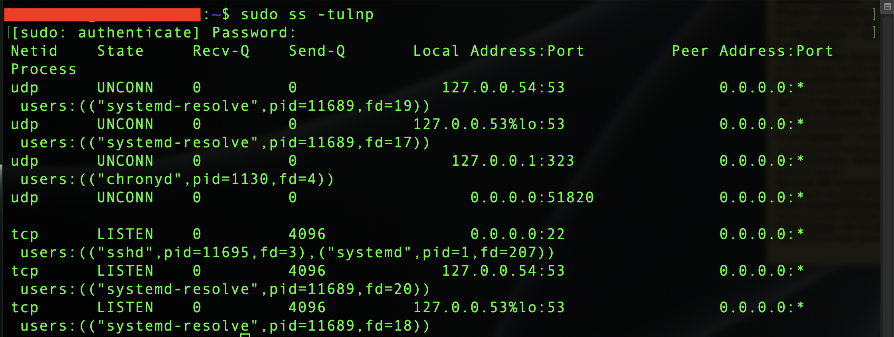
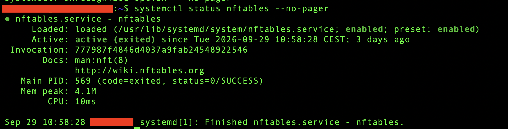
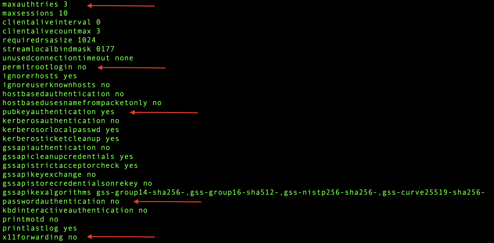
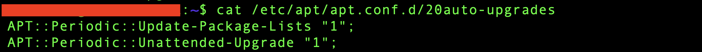
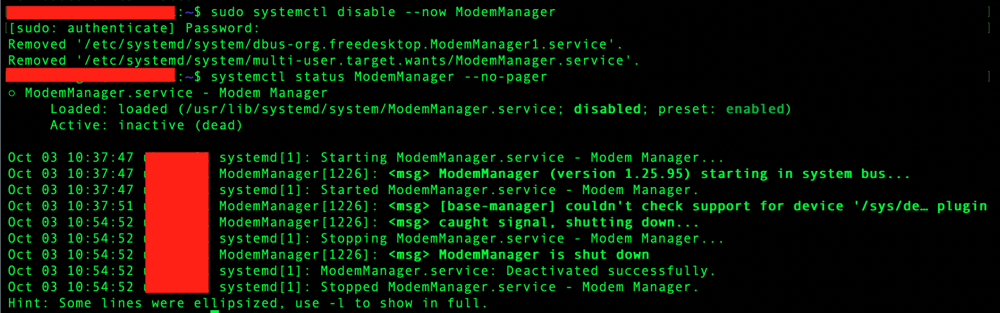

# Phase 10 – Linux Security & Hardening

> **Status:** ✅ Completed

---

## Purpose & Objectives

The goal of this phase was to review the basic security settings of my Ubuntu Server after completing the main services and Active Directory integration.

I checked the existing configuration, installed available package updates, and disabled an unused service.

The main objectives were:
- Review listening ports and firewall rules.
- Verify the SSH security settings from Phase 4.
- Check my local account's sudo permissions.
- Review automatic security update settings.
- Update the server and check access after reboot.
- Review running services and disable an unused service.

---

## Environment

| Component | Detail |
|:---|:---|
| **Server** | Ubuntu Server 26.04 LTS VM on Proxmox VE |
| **Firewall** | nftables |
| **Remote Administration** | OpenSSH with key authentication |
| **VPN** | WireGuard |
| **AD Integration** | SSSD |
| **Automatic Updates** | unattended-upgrades |

*Internal network details are omitted from the text, and identifying information is hidden in screenshots.*

---

## 1. Listening Ports Review

I reviewed the listening TCP and UDP ports:

```bash
sudo ss -tulnp
```

| Port | Service | Listening Address |
|:---|:---|:---|
| TCP 22 | SSH | All IPv4 interfaces |
| UDP 51820 | Configured WireGuard port | All IPv4 interfaces |
| TCP/UDP 53 | Local DNS resolver | Localhost |
| UDP 323 | chrony command port | Localhost |

I checked the listening ports together with the firewall rules to review network access. I reviewed the firewall rules to understand which connections were allowed.



---

## 2. Firewall Review

I checked the active rules, the nftables service, and the saved configuration:

```bash
sudo nft list ruleset
systemctl status nftables --no-pager
sudo cat /etc/nftables.conf
```

The existing rules:
- Blocked incoming and forwarded traffic by default.
- Allowed established and related traffic.
- Allowed local loopback communication.
- Limited SSH access to the LAN and VPN subnets.
- Allowed WireGuard connections on UDP port 51820.
- Allowed IPv4 ICMP traffic.
- Allowed VPN-to-LAN forwarding and used NAT for VPN traffic.
- Allowed outgoing traffic from the server.

The saved configuration matched the active rules. The nftables service was enabled at boot and had loaded the rules successfully.

The nftables service was enabled at boot and loaded the saved rules successfully. I kept the existing firewall configuration.



---

## 3. SSH Security Review

I reviewed the effective SSH configuration:

```bash
sudo sshd -T
```

The security settings from Phase 4 remained in place:

| Setting | Value |
|:---|:---|
| Direct root login | Disabled |
| Public key authentication | Enabled |
| Password authentication | Disabled |
| Keyboard-interactive authentication | Disabled |
| X11 forwarding | Disabled |
| Maximum authentication attempts per connection | 3 |

I confirmed that SSH key login worked. No server-side SSH changes were needed.



---

## 4. Local Administrator Permissions

I checked my account's sudo permissions and the local sudo group:

```bash
sudo -l
getent group sudo
```

My local administrator account could run all commands with sudo. Only that account was listed in the local sudo group.

I used a normal user session and added `sudo` when an administrative command required it. This check covered my local account and sudo group; it was not a full review of every possible sudo rule.

---

## 5. Package Updates & Verification

I refreshed the package list, reviewed available updates, and installed them:

```bash
sudo apt update
apt list --upgradable
sudo apt upgrade
```

The package list showed 25 available updates, including kernel and Netplan packages.

After the upgrade finished, I restarted the server and checked the running kernel:

```bash
sudo reboot
uname -r
```

The running kernel after reboot was `7.0.0-38-generic`.

I also checked the main services:

```bash
systemctl status nftables wg-quick@wg0 sssd --no-pager
```

| Check | Result |
|:---|:---|
| SSH access after reboot | Successful |
| nftables | Active; rules loaded successfully |
| WireGuard | Active; VPN interface started successfully |
| SSSD | Active and running |
| iPhone VPN access to Proxmox | Successful |

SSSD was running after reboot. AD login permissions were not retested in this phase.

---

## 6. Automatic Security Updates

I checked the installed package and its configuration files:

```bash
dpkg -l unattended-upgrades
cat /etc/apt/apt.conf.d/20auto-upgrades
cat /etc/apt/apt.conf.d/50unattended-upgrades
```

The `unattended-upgrades` package was already installed. Periodic package-list updates and unattended upgrades were enabled:

```text
APT::Periodic::Update-Package-Lists "1";
APT::Periodic::Unattended-Upgrade "1";
```

The allowed sources included security updates and the base release source for dependencies. The regular `-updates` source was not enabled in this file for unattended upgrades.

I kept the existing configuration. Normal package updates still needed regular review.



---

## 7. Running Services Review

I listed the running services:

```bash
systemctl list-units --type=service --state=running --no-pager
```

ModemManager was running, but this VM did not use a mobile broadband modem. I stopped the service and disabled its automatic startup:

```bash
sudo systemctl disable --now ModemManager
systemctl status ModemManager --no-pager
```

The result showed `disabled` and `inactive (dead)`. The package was not removed.



---

## Lessons Learned

- Listening ports and firewall permissions need to be reviewed together.
- A systemd service can be active even when its status is `active (exited)`.
- Sudo provides administrative access without using a root session for normal work.
- Automatic security updates do not replace regular package maintenance.
- A service should only be disabled after understanding its purpose.
- Access and important services should be checked after updates and a reboot.

---

## Result

I completed a basic security review of the Ubuntu Server. I verified the existing firewall and SSH settings, checked local administrator permissions, reviewed automatic updates, and disabled ModemManager.

After the package updates and reboot, SSH access worked, the main services started automatically, and I could reach Proxmox through WireGuard.

---

## Navigation

| Previous | Home | Next |
|:--------:|:----:|:----:|
| ⬅️ [Phase 9: Active Directory Integration & Centralized Authentication](../9-Active-Directory-Integration-Centralized-Authentication/README.md)  | 🏠 [Home](../../README.md) | ➡️ Docker & Containers *(Coming Soon)* |
