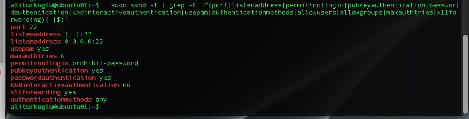
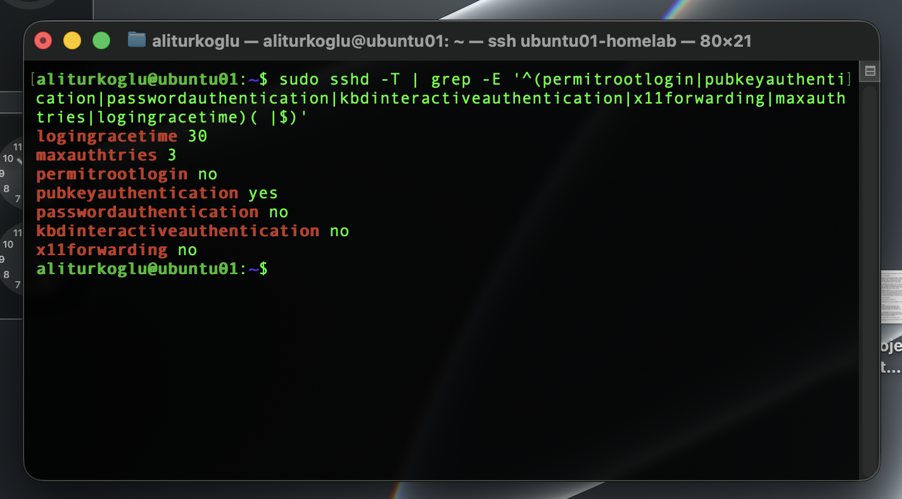
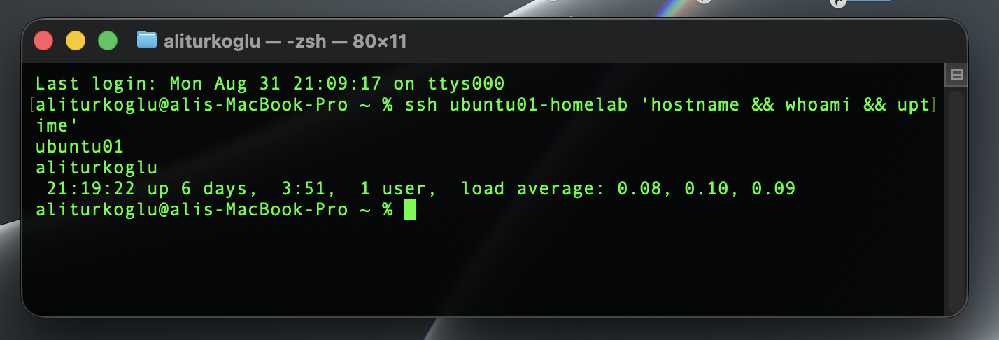
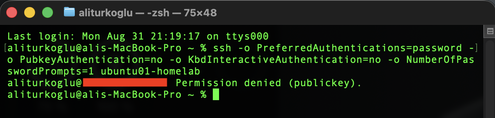

# Phase 4 – SSH & Remote Administration

> **Status:** ✅ Completed

---

## Purpose

The goal of this phase was to configure secure remote administration for the Ubuntu Server and understand how SSH is used in daily Linux administration.

I replaced password-based SSH access with an ED25519 key, applied basic SSH security settings, tested remote commands and secure file transfer, and reviewed SSH authentication logs.

The firewall was reviewed but not enabled because firewall configuration is planned for a later security phase.

---

## Objectives

- Review the current SSH service and configuration.
- Understand SSH client and server communication.
- Configure ED25519 key-based authentication.
- Verify SSH key and file permissions.
- Disable password-based SSH login.
- Disable direct root SSH login.
- Apply basic SSH hardening settings.
- Configure an SSH profile on the MacBook.
- Execute commands remotely through SSH.
- Transfer files securely with `scp`.
- Review SSH authentication logs.
- Perform basic SSH troubleshooting.
- Verify the final SSH configuration and connection.

---

## Environment

| Component | Configuration |
| :--- | :--- |
| **Server** | Ubuntu Server 26.04 LTS |
| **Hostname** | `ubuntu01` |
| **Virtualization** | Proxmox VE |
| **Administration Client** | MacBook Pro |
| **SSH Server** | OpenSSH |
| **SSH Port** | TCP 22 |
| **Administrator Account** | `aliturkoglu` |

> Private IP addresses and sensitive SSH information are not published in this repository.

---

## SSH Overview

SSH stands for **Secure Shell** and provides encrypted communication between systems.

In this environment, the MacBook works as the SSH client and `ubuntu01` works as the SSH server.

```text
MacBook
SSH Client
    |
    | SSH / TCP 22
    v
ubuntu01
OpenSSH Server
```

SSH is used for:

- Remote terminal access
- Remote command execution
- Secure file transfer
- Linux server administration

---

## Initial SSH Assessment

Before changing the configuration, I checked the SSH service and socket:

```bash
sudo systemctl status ssh --no-pager
sudo systemctl status ssh.socket --no-pager
```

The SSH service was active and running. The server was listening on TCP port 22.

I also reviewed the effective SSH configuration with:

```bash
sudo sshd -T
```

The initial configuration showed that:

- Public-key authentication was enabled.
- Password authentication was enabled.
- Root login was not fully disabled.
- Keyboard-interactive authentication was disabled.
- X11 forwarding was enabled.
- The maximum authentication attempts were set to six.

This provided a baseline before changing the SSH configuration.



---

## SSH Key Authentication

### Creating an ED25519 Key

I created a dedicated ED25519 SSH key on the MacBook:

```bash
ssh-keygen -t ed25519 -a 100 -f "$HOME/.ssh/id_ed25519_ubuntu01" -C "ubuntu01-phase4"
```

The private key was protected with a passphrase.

The private key remains only on the MacBook and is not stored in this repository.

### Installing the Public Key

I copied the public key to the Ubuntu administrator account:

```bash
ssh-copy-id -i "$HOME/.ssh/id_ed25519_ubuntu01.pub" aliturkoglu@<ubuntu01-address>
```

The existing account password was used only to authorize the initial public-key installation.

After the key was installed, I checked the SSH directory permissions:

```bash
stat -c '%A %a %U:%G %n' "$HOME/.ssh" "$HOME/.ssh/authorized_keys"
```

The final permissions were:

```text
.ssh              700
authorized_keys   600
```

These strict permissions help protect the SSH authentication files from unauthorized access.

---

## Key Login Verification

Before disabling password authentication, I opened a second SSH connection using only the new key:

```bash
ssh -i "$HOME/.ssh/id_ed25519_ubuntu01" \
    -o IdentitiesOnly=yes \
    aliturkoglu@<ubuntu01-address>
```

The connection was successful.

This second session confirmed that key authentication worked before password-based SSH login was disabled.

---

## SSH Hardening

I created a separate SSH configuration file for the custom hardening settings:

```text
/etc/ssh/sshd_config.d/00-homelab-hardening.conf
```

The configuration contains:

```text
# Phase 4 - HomeLab SSH hardening

PermitRootLogin no
PubkeyAuthentication yes
PasswordAuthentication no
KbdInteractiveAuthentication no
X11Forwarding no
MaxAuthTries 3
LoginGraceTime 30
```

The settings provide the following changes:

| Setting | Purpose |
| :--- | :--- |
| `PermitRootLogin no` | Prevent direct SSH login as root |
| `PubkeyAuthentication yes` | Allow SSH key authentication |
| `PasswordAuthentication no` | Disable SSH password login |
| `KbdInteractiveAuthentication no` | Disable keyboard-interactive authentication |
| `X11Forwarding no` | Disable unused X11 forwarding |
| `MaxAuthTries 3` | Reduce the number of authentication attempts per connection |
| `LoginGraceTime 30` | Limit the time allowed to complete authentication |

I did not configure `AllowUsers` because Active Directory integration and centralized Linux access control are planned for later phases.

---

## Configuration Validation

Before reloading SSH, I checked the configuration syntax:

```bash
sudo sshd -t
```

The command returned without an error.

I then reviewed the effective security settings:

```bash
sudo sshd -T | grep -E '^(permitrootlogin|pubkeyauthentication|passwordauthentication|kbdinteractiveauthentication|x11forwarding|maxauthtries|logingracetime)( |$)'
```

The final effective values were:

```text
logingracetime 30
maxauthtries 3
permitrootlogin no
pubkeyauthentication yes
passwordauthentication no
kbdinteractiveauthentication no
x11forwarding no
```

After the validation, I reloaded SSH:

```bash
sudo systemctl reload ssh
```

The service remained active.



---

## MacBook SSH Profile

To simplify daily administration, I created an SSH client profile on the MacBook.

The configuration is stored in:

```text
~/.ssh/config
```

Example:

```text
Host ubuntu01-homelab
    HostName <ubuntu01-address>
    User aliturkoglu
    IdentityFile ~/.ssh/id_ed25519_ubuntu01
    IdentitiesOnly yes
    AddKeysToAgent yes
    UseKeychain yes
```

I secured the SSH client configuration file:

```bash
chmod 600 "$HOME/.ssh/config"
```

I also added the private key to the macOS SSH agent and Keychain:

```bash
ssh-add --apple-use-keychain "$HOME/.ssh/id_ed25519_ubuntu01"
```

The server can now be accessed with the shorter command:

```bash
ssh ubuntu01-homelab
```

---

## Remote Command Execution

SSH can execute commands on a remote server without opening an interactive shell.

From the MacBook, I tested:

```bash
ssh ubuntu01-homelab 'hostname && whoami && uptime'
```

The commands were executed on `ubuntu01` and returned the remote hostname, user account, and system uptime.

This confirmed that SSH could be used for remote administration tasks.



---

## Secure File Transfer with SCP

`scp` stands for **Secure Copy Protocol** and uses SSH to transfer files securely between systems.

I transferred a test file from the MacBook to Ubuntu:

```bash
scp ssh-test.txt ubuntu01-homelab:~/
```

On Ubuntu, I verified the transferred file:

```bash
ls -l ~/ssh-test.txt
cat ~/ssh-test.txt
```

The file was successfully transferred and the content was correct.

The temporary test file was removed after verification.

---

## Password Authentication Test

After key authentication was working, I tested whether password-only SSH access was still possible.

From the MacBook, I forced the SSH client to use password authentication without using the public key.

The server returned:

```text
Permission denied (publickey).
```

This was the expected result.

It confirmed that password-based SSH authentication was disabled while key-based authentication remained available.



---

## SSH Logs and Troubleshooting

SSH authentication events can be reviewed with `journalctl`.

I checked recent SSH events with:

```bash
sudo journalctl -u ssh --since "15 minutes ago" --no-pager
```

The journal showed a successful key-based authentication:

```text
Accepted publickey
```

The password-only test appeared as a connection that was closed before authentication was completed:

```text
Connection closed by authenticating user ... [preauth]
```

This helped connect the client-side error with the server-side log information.

A simple troubleshooting process is:

```text
Connection Problem
        |
        v
Check SSH Service
        |
        v
Check SSH Configuration
        |
        v
Check Authentication Logs
        |
        v
Identify the Cause
        |
        v
Test a New Connection
```

---

## Final Verification

At the end of the phase, I performed a final verification.

I checked the SSH configuration syntax:

```bash
sudo sshd -t
```

I reviewed the effective SSH settings:

```bash
sudo sshd -T
```

I checked the SSH service:

```bash
sudo systemctl status ssh --no-pager
```

Finally, I opened a completely new SSH connection from the MacBook:

```bash
ssh ubuntu01-homelab
```

The new connection was successful with the ED25519 key.

The final SSH state was:

- SSH service active
- TCP port 22 in use
- Public-key authentication enabled
- Password authentication disabled
- Direct root SSH login disabled
- Keyboard-interactive authentication disabled
- X11 forwarding disabled
- Maximum authentication attempts set to three
- Login grace time set to 30 seconds
- MacBook SSH profile working
- Remote command execution working
- Secure file transfer working

---

## Firewall Scope

I checked the current UFW status:

```bash
sudo ufw status verbose
```

UFW was installed but inactive.

I intentionally did not enable the firewall during this phase.

Before enabling a firewall, the required services and ports should first be identified. SSH access must also be protected from accidental lockout.

Firewall configuration is therefore planned for the later **Linux Security & Firewall** phase.

---

## Lessons Learned

- A working key-based SSH session should be verified before disabling password authentication.
- SSH configuration should be validated with `sshd -t` before applying changes.
- `sshd -T` is useful for checking the effective SSH configuration.
- Public-key authentication provides secure remote access without using the account password for SSH login.
- SSH logs are useful for understanding successful and failed authentication attempts.
- Remote commands can be executed without opening an interactive shell.
- `scp` can securely transfer files through SSH.
- An existing SSH session does not prove that a new connection will still work.
- Firewall rules should be planned before enabling the firewall on a remotely managed server.

---

## Result

Phase 4 – SSH & Remote Administration was successfully completed.

The Ubuntu Server can now be securely administered from the MacBook using an ED25519 SSH key.

Password-based SSH login and direct root SSH login are disabled. The SSH configuration was validated, remote command execution and secure file transfer were tested, and authentication events were reviewed with the system journal.

The local Ubuntu administrator account remains available for administration and recovery before future Active Directory integration.

---

## Navigation

| Previous | Home | Next |
| :--- | :---: | ---: |
| ⬅️ [**3-Linux Filesystem & Storage Basics**](../3-Linux-Filesystem-Storage-Basics/README.md) | 🏠 [**Home**](../../README.md) | ➡️ [**Phase 5 – Package Management & Updates**](../5-Package-Service-Management/README.md) |
