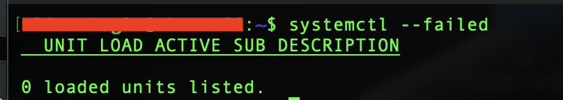

# Phase 5 – Package & Service Management

> **Status:** ✅ Completed

---

## Overview

This phase focused on basic package and service management on Ubuntu Server.

I practiced how to update packages, review APT repositories, install and remove software, and manage services with systemd. I also checked how automatic security updates are configured on the server.

The work was completed on the existing `ubuntu01` HomeLab server using real packages and services.

---

## Objectives

- Understand basic package management with APT.
- Update packages and review changes before installation.
- Install and remove software packages.
- Understand the difference between `remove` and `purge`.
- Review the Ubuntu repository configuration.
- Learn basic systemd and `systemctl` commands.
- Start, stop, restart, and reload services.
- Understand the difference between `active` and `enabled`.
- Test `enable` and `disable` behavior.
- Review automatic security update settings.
- Perform a final system health check.

---

## Environment

| Component | Configuration |
|---|---|
| Server | Ubuntu Server VM |
| Operating System | Ubuntu Server 26.04 LTS |
| Codename | Resolute |
| Hypervisor | Proxmox VE |
| Remote Administration | SSH |
| Package Manager | APT |
| Service Manager | systemd |

The Ubuntu version was verified with:

```bash
lsb_release -a
```

---

## 1. Package Updates

### Updating the Package Index

Before installing updates, I refreshed the local APT package index:

```bash
sudo apt update
```

`apt update` downloads the latest package information from the configured repositories. It does not install package updates.

Available upgrades were checked with:

```bash
apt list --upgradable
```

### Simulating the Upgrade

Before applying changes, I simulated the upgrade:

```bash
sudo apt upgrade --simulate
```

The simulation showed:

- 31 packages to upgrade
- 7 new dependencies
- 0 package removals
- 2 phased updates
- security updates
- a new Linux kernel

This allowed me to review the planned changes before installing them.

### Applying the Upgrade

The active kernel before the upgrade was checked with:

```bash
uname -r
```

The server was running:

```text
7.0.0-30
```

The available updates were installed with:

```bash
sudo apt upgrade
```

Because a new kernel was installed, Ubuntu required a reboot.

```bash
sudo reboot
```

After reconnecting through SSH, I checked the kernel again:

```bash
uname -r
```

| Kernel Upgrade Verification |
|:---------------------------:|
|  |

The active kernel was now:

```text
7.0.0-31
```

Two packages remained as phased updates. I did not force them manually and allowed them to follow the normal Ubuntu rollout process.

---

## 2. Package Cleanup

Before removing unused packages, I simulated the cleanup:

```bash
sudo apt autoremove --simulate
```

The simulation showed that an older kernel and unused dependencies could be removed.

The cleanup was then applied:

```bash
sudo apt autoremove
```

This removed unused packages and the older `7.0.0-29` kernel while keeping the current and previous kernels available.

---

## 3. APT Repository Configuration

I checked the repository directory:

```bash
ls /etc/apt/sources.list.d
```

The active Ubuntu repository configuration was reviewed with:

```bash
cat /etc/apt/sources.list.d/ubuntu.sources
```

The server uses:

- the German Ubuntu mirror for standard packages
- the official Ubuntu security repository
- `main`
- `restricted`
- `universe`
- `multiverse`

| APT Repository Configuration |
|:----------------------------:|
|  |

The legacy repository file was also checked:

```bash
cat /etc/apt/sources.list
```

It showed that the main repository configuration has moved to:

```text
/etc/apt/sources.list.d/ubuntu.sources
```

The directory was reviewed in more detail with:

```bash
ls -l /etc/apt/sources.list.d
```

No separate third-party repository or PPA was configured.

---

## 4. Package Installation and Removal

The `ncdu` package was used to practice a simple package lifecycle.

First, I checked whether it was already installed:

```bash
apt list --installed ncdu
```

No installed package was returned.

I installed it with:

```bash
sudo apt install ncdu
```

The installation was verified with:

```bash
apt list --installed ncdu
```

The package was then removed:

```bash
sudo apt remove ncdu
```

Finally, I checked its package state:

```bash
dpkg -l ncdu
```

No package entry remained because `ncdu` did not leave package-managed configuration files behind.

### Remove vs. Purge

```bash
sudo apt remove <package>
```

`remove` removes the package but can leave package-managed configuration files behind.

```bash
sudo apt purge <package>
```

`purge` removes both the package and its package-managed configuration files.

For `ncdu`, an additional purge was not required.

---

## 5. systemd and Service Management

Ubuntu uses systemd to manage services and other system units.

`systemctl` is the main command used to inspect and control systemd units.

Running services were listed with:

```bash
systemctl list-units --type=service --state=running
```

Some important running services included:

- SSH
- QEMU Guest Agent
- cron
- chrony
- rsyslog
- systemd-networkd
- unattended-upgrades

### SSH Socket Activation

The SSH service was checked with:

```bash
systemctl status ssh
```

The service was running, but the service unit itself showed as `disabled`.

I then checked:

```bash
systemctl status ssh.socket
```

| SSH Socket Status |
|:-----------------:|
|  |

The socket was enabled and active. It listens for SSH connections and triggers `ssh.service` when needed.

This also showed the difference between two important systemd states:

```text
active  = running now
enabled = configured for automatic startup
```

The states were checked separately with:

```bash
systemctl is-active ssh.socket
```

```bash
systemctl is-enabled ssh.socket
```

---

## 6. Start, Stop, Restart, and Reload

The QEMU Guest Agent was used to practice basic service management.

Its status was checked with:

```bash
systemctl status qemu-guest-agent
```

The service was stopped:

```bash
sudo systemctl stop qemu-guest-agent
```

The status changed to:

```text
inactive (dead)
```

| QEMU Guest Agent Stopped |
|:------------------------:|
|  |

The service was started again:

```bash
sudo systemctl start qemu-guest-agent
```

It returned to `active (running)`.

### Restart

The service was restarted with:

```bash
sudo systemctl restart qemu-guest-agent
```

After the restart, the service was running with a new process ID.

### Reload

Not every service supports `reload`.

I checked the QEMU Guest Agent unit for an `ExecReload` entry:

```bash
systemctl cat qemu-guest-agent | grep ExecReload
```

No result was returned.

SSH does support reload, which was checked with:

```bash
systemctl cat ssh | grep ExecReload
```

Before reloading SSH, I tested the configuration syntax:

```bash
sudo sshd -t
```

No output was returned, which means the syntax check passed.

The SSH service was then reloaded:

```bash
sudo systemctl reload ssh
```

The result was checked with:

```bash
systemctl status ssh
```

| SSH Service Reload |
|:------------------:|
|  |

The main SSH process ID remained the same.

In this test:

```text
restart = stop and start the service again
reload  = reload the configuration without a full restart, if supported
```

---

## 7. Enable and Disable Services

The `cron` service was used to test boot behavior.

First, its state was checked:

```bash
systemctl is-enabled cron
```

The result was:

```text
enabled
```

I disabled the service:

```bash
sudo systemctl disable cron
```

Then I checked whether it was still running:

```bash
systemctl is-active cron
```

The result was still:

```text
active
```

This showed that disabling a service does not automatically stop a running service.

The original configuration was restored:

```bash
sudo systemctl enable cron
```

The final state was checked again:

```bash
systemctl is-enabled cron
```

The result was:

```text
enabled
```

The main difference is:

```text
start / stop       = current runtime state
enable / disable   = automatic startup behavior
```

---

## 8. Automatic Security Updates

The `unattended-upgrades` package was already installed.

I checked it with:

```bash
apt list --installed unattended-upgrades
```

The related service was also reviewed:

```bash
systemctl status unattended-upgrades
```

### APT Daily Upgrade Timer

The automatic upgrade timer was checked with:

```bash
systemctl status apt-daily-upgrade.timer
```

| APT Daily Upgrade Timer |
|:-----------------------:|
|  |

The timer was enabled and waiting for its next scheduled run.

### Allowed Update Sources

The unattended-upgrades repository configuration was reviewed with:

```bash
grep -A 10 "Allowed-Origins" /etc/apt/apt.conf.d/50unattended-upgrades
```

The `-A 10` option shows the matching line and the following 10 lines.

The configuration allows security updates for unattended installation. Normal `-updates` and `-proposed` sources were not enabled for unattended upgrades.

| Unattended Upgrades Policy | Auto Upgrades Configuration |
|:--------------------------:|:---------------------------:|
|  |  |

### Automatic Reboot

The reboot settings were checked with:

```bash
grep -n "Automatic-Reboot" /etc/apt/apt.conf.d/50unattended-upgrades
```

The related settings were commented out.

I also checked the effective APT configuration:

```bash
apt-config dump | grep Automatic-Reboot
```

No active automatic reboot setting was returned.

For this HomeLab, security updates can be installed automatically, while reboots are handled manually when needed.

### Periodic APT Settings

The periodic APT configuration was checked with:

```bash
cat /etc/apt/apt.conf.d/20auto-upgrades
```

The configuration contained:

```text
APT::Periodic::Update-Package-Lists "1";
APT::Periodic::Unattended-Upgrade "1";
```

This confirmed that periodic package list updates and unattended upgrades are enabled.

---

## 9. Final Verification

After completing the tests, I performed a final system check.

Failed systemd units were checked with:

```bash
systemctl --failed
```

| Final System Health Check |
|:-------------------------:|
|  |

The result was:

```text
0 loaded units listed.
```

The final checks also confirmed:

| Check | Result |
|---|---|
| Active kernel | `7.0.0-31` |
| SSH socket | Active |
| APT daily upgrade timer | Active |
| Failed systemd units | 0 |
| Pending updates | 2 phased updates |

---

## Lessons Learned

1. **APT:** `apt update` refreshes package information, while `apt upgrade` installs available updates.
2. **Simulation:** `--simulate` is useful for reviewing package changes before applying them.
3. **Kernel Updates:** A new kernel becomes active after a reboot.
4. **Package Cleanup:** `apt autoremove` can remove unused dependencies and older kernel packages.
5. **Remove vs. Purge:** `remove` can leave configuration files behind, while `purge` also removes them.
6. **Repositories:** Ubuntu 26.04 uses `/etc/apt/sources.list.d/ubuntu.sources` for the main repository configuration.
7. **systemd States:** `active` and `enabled` describe different service states.
8. **Service Management:** `start`, `stop`, `restart`, `reload`, `enable`, and `disable` have different purposes.
9. **Automatic Updates:** Security updates can run automatically while reboots remain manual in this HomeLab.

---

## Result

In this phase, I practiced basic package and service management on the Ubuntu Server.

I updated the system, activated a new kernel, cleaned unused packages, reviewed APT repositories, and tested package installation and removal.

I also practiced basic systemd service management and reviewed the automatic security update configuration.

The final check showed no failed systemd units.

---

## Navigation

| Previous | Home | Next |
|:--------:|:----:|:----:|
| ⬅️ [Phase 4: SSH & Remote Administration](../4-SSH-Remote-Administration/README.md) | 🏠 [Home](../../README.md) | ➡️ Phase 6: Processes & Logs *(Coming Soon)* |
