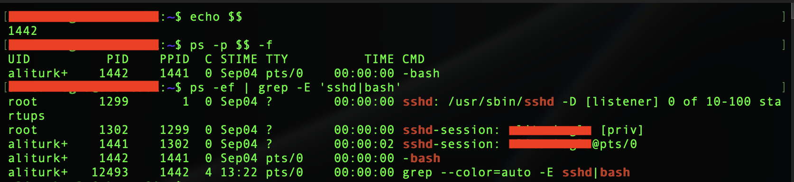
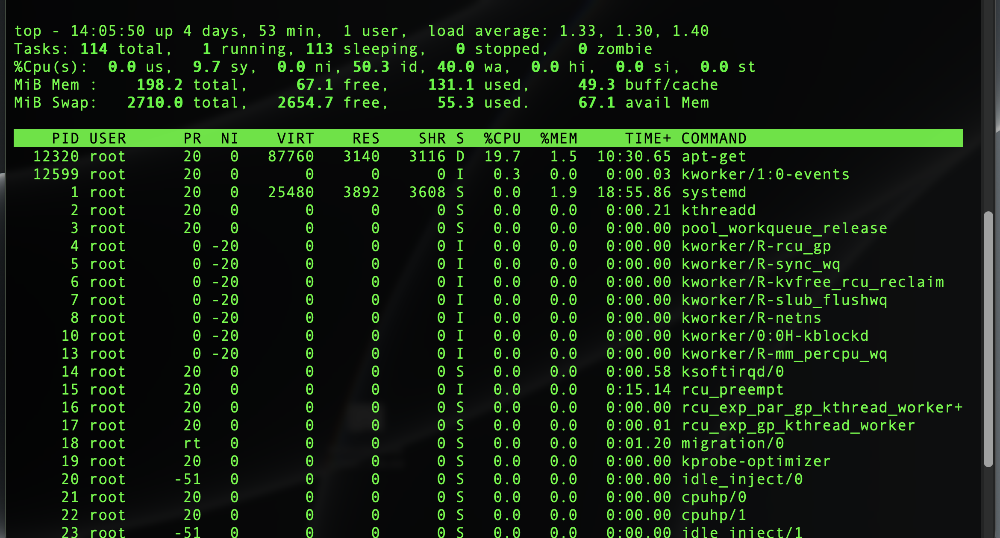
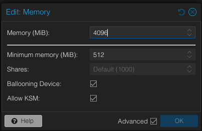
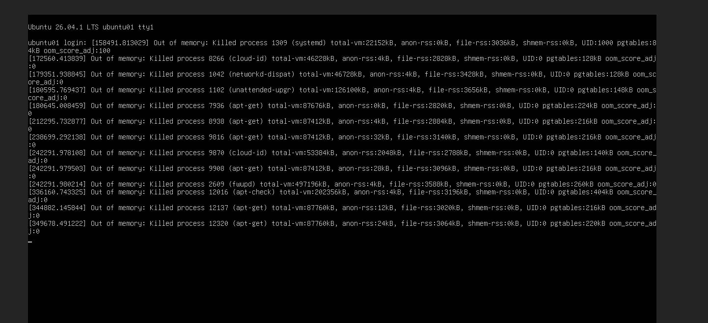
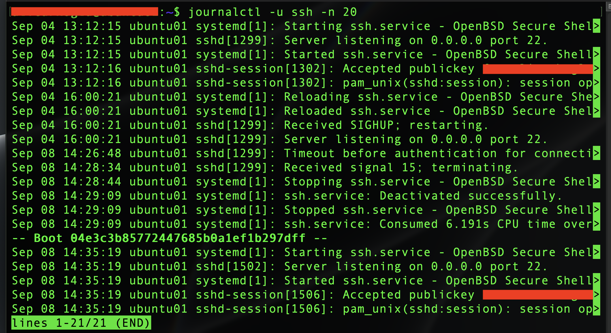
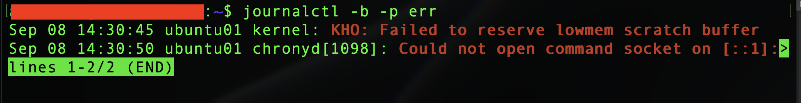
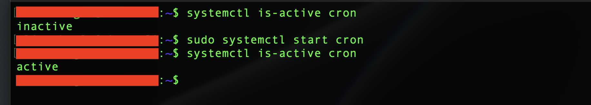

# Phase 6 – Processes, Logs & Troubleshooting

> **Status:** ✅ Completed

---

## Purpose & Objectives

The goal of this phase was to practice basic Linux process monitoring, resource monitoring, log analysis, and troubleshooting on `ubuntu01`.

During this phase, I worked with running processes, CPU and memory usage, systemd services, and system logs. I also encountered a real memory-related performance problem and used the available system information to identify and resolve it.

The main objectives were:
- Inspect running processes and understand PID and PPID relationships.
- Find specific processes without reviewing the complete process list.
- Monitor CPU, memory, swap, uptime, and system load.
- Review system and service logs with `journalctl`.
- Filter logs by service, boot, and priority.
- Check systemd service states and failed units.
- Troubleshoot a real resource problem (Out-of-Memory).
- Perform a controlled service stop and start test.

---

## Environment

| Component | Configuration |
| :--- | :--- |
| **Server** | `ubuntu01` |
| **Operating System** | Ubuntu Server 26.04 LTS |
| **Virtualization** | Proxmox VE |
| **CPU** | 2 vCPU |
| **Memory** | Up to 4 GiB (with memory ballooning) |
| **Administration** | SSH with public-key authentication |

---

## 1. Process Inspection

I started by inspecting running processes and checking how processes are related to each other. The following commands were used:
```bash
ps
ps -ef
echo $$
ps -p $$ -f
```

`ps` displays running processes, while `ps -ef` provides a more detailed system-wide process list. `echo $$` shows the PID of the current Bash shell. I used this together with `ps` to check the PID and PPID values of my SSH session.

I also filtered the process list to focus on the SSH and Bash processes:
```bash
ps -ef | grep -E 'sshd|bash'
```
This showed the relationship between the SSH service, the SSH session, and my Bash shell.

| Process Identification |
|:----------------------:|
|  |

To find processes more quickly, I also used `pgrep -a bash` and `ps -u $USER`. These commands are useful when the full process list contains too much information.

---

## 2. CPU and Memory Monitoring

I used standard Linux commands to check the current resource usage of the server.
```bash
top
```
`top` provides a live view of running processes, CPU usage, memory usage, and system load.

| Resource Monitoring with Top |
|:----------------------------:|
|  |

For a simpler view of memory and system load, I used `free -h` and `uptime`. These checks provided a quick overview of the server health before deeper troubleshooting.

---

## 3. Resource Pressure Troubleshooting (Real Out-of-Memory Event)

While monitoring the system, I noticed that commands were responding more slowly than before. SSH connections also started to respond very slowly. Instead of restarting services immediately, I checked the current system state.

The resource monitoring showed that the VM had much less memory available than expected. The server was configured with up to 4 GiB of RAM, but Proxmox "memory ballooning" allowed the VM memory to fall to a very low level. The VM configuration showed a minimum memory value of only 512 MiB.

| Memory Ballooning Config | Out of Memory (OOM) Events |
|:------------------------:|:--------------------------:|
|  |  |

The problem became more serious and the Proxmox console showed several Linux Out-of-Memory (OOM) events. The kernel OOM mechanism had started terminating processes (including APT-related processes) because there was not enough available memory.

**The Troubleshooting Workflow:**
1. **Symptom:** Commands and SSH connections became slow.
2. **Information:** I checked CPU, memory, load, and running processes.
3. **Finding:** The VM was running with very little available memory.
4. **Evidence:** The console showed multiple `Out of memory` events.
5. **Root Cause:** The minimum Proxmox ballooning memory was configured too low for the Ubuntu workload.
6. **Fix:** I increased the minimum VM memory from 512 MiB to 2 GiB while keeping the maximum at 4 GiB.
7. **Verification:** After restarting the server, memory availability improved and SSH connections worked normally again.

*Note: I kept memory ballooning enabled because the Proxmox host has limited RAM and also runs other HomeLab systems. Increasing the minimum memory provided a better balance between VM stability and host resource usage.*

After the change, I verified the system again with `free -h`, `uptime`, and `pgrep -a apt`. The system load returned to normal, swap usage returned to normal, and no active APT process remained.

---

## 4. Service Status Checks

I used `systemctl` to check the state of systemd services:
```bash
systemctl status ssh
systemctl is-active ssh
systemctl is-enabled ssh
```
`systemctl status` provides detailed service information, while `is-active` and `is-enabled` provide quick checks for the current service state and startup configuration.

After resolving the memory problem, I also checked the system for failed units using `systemctl --failed`. No failed systemd units were found.

---

## 5. Service Logs with journalctl

I used `journalctl` to review system logs and service-specific events. To focus on the SSH service:
```bash
journalctl -u ssh -n 20
```
The SSH logs showed service start and stop events, successful public-key authentication, and the service starting again after a system reboot.

| SSH Journal Logs |
|:----------------:|
|  |

---

## 6. Filtering System Logs

Instead of reviewing the complete journal, I used filters to focus on relevant events. For troubleshooting the current system state, I combined the boot (`-b`) and priority (`-p err`) filters:
```bash
journalctl -b -p err
```
This helped separate previous Out-of-Memory events from messages generated after the recent restart.

| Journal Error Filtering |
|:-----------------------:|
|  |

One error-level entry was related to `chronyd`. I checked the service and system time with `systemctl status chrony` and `timedatectl`. The Chrony service was active, NTP was active, and the system clock was synchronized. No configuration change was required. 

---

## 7. Controlled Service Troubleshooting Test

To practice basic service troubleshooting without affecting a critical service, I used the `cron` service.

1. I checked the state (`systemctl status cron`).
2. I stopped the service (`sudo systemctl stop cron`).
3. I verified it was down (`systemctl is-active cron` returned `inactive`).
4. I started the service again (`sudo systemctl start cron`).
5. I verified it was up (`systemctl is-active cron` returned `active`).

| Service Stop and Start Verification |
|:-----------------------------------:|
|  |

This test also showed the difference between an `inactive` and a `failed` service. The `cron` service was intentionally stopped, so the inactive state did not indicate a service failure.

---

## Lessons Learned

- **Troubleshooting Workflow:** The practical troubleshooting during this phase followed a clear process: *Symptom → Information → Hypothesis → Test → Fix → Verification*. Instead of making changes immediately, gathering information first is critical.
- **Resource Impacts:** Low available memory can affect services and remote administration even when network connectivity is still available. Virtual machine resource settings (like Ballooning) can directly affect Linux system stability.
- **Process Trees:** PID identifies a process, while PPID identifies its parent process. `ps` and `pgrep` provide different ways to inspect and locate running processes.
- **Log Filtering:** `journalctl` can be filtered by service, boot, and priority to reduce unnecessary log output. Old log entries should not automatically be treated as current problems.
- **Verification:** A log error should be verified against the actual service state before making configuration changes (like the Chrony example).
- **Service States:** `inactive` does not always mean that a service has failed.

---

## Result

The main process, resource, service, and logging tools were tested successfully on `ubuntu01`.

A real memory pressure problem was identified through system monitoring and console messages. The Proxmox memory configuration was adjusted, the server was restarted, and normal performance was restored.

The server finished the phase with responsive SSH access, synchronized system time, and no failed systemd units.

---

## Navigation

| Previous | Home | Next |
|:--------:|:----:|:----:|
| ⬅️ [Phase 5: Package & Service Management](../5-Package-Service-Management/README.md) | 🏠 [Home](../../README.md) | ➡️ Phase 7: Linux Networking *(Coming Soon)* |
