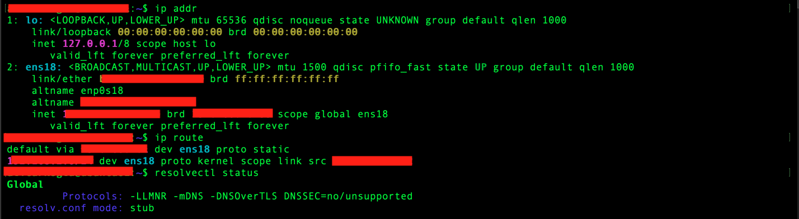
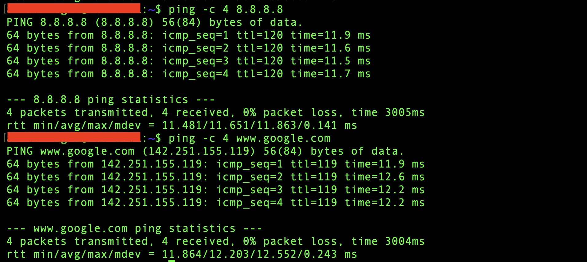
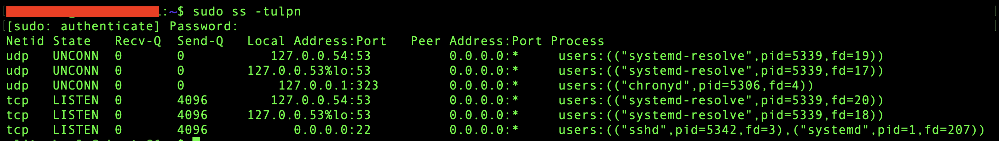
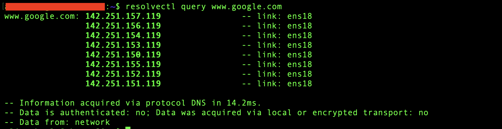

# Phase 7 – Linux Networking

> **Status:** ✅ Completed

---

## Purpose & Objectives

The goal of this phase was to understand and verify the basic network configuration of the Ubuntu Server.

I worked with network interfaces, IP addressing, routing, DNS, listening ports, active connections, and basic network troubleshooting.

The main objectives were:
- Review the active network interface and IP configuration.
- Understand the default gateway and routing table.
- Verify Internet connectivity and DNS resolution.
- Review listening ports and active connections.
- Test TCP port connectivity.
- Review the persistent Netplan configuration.
- Practice a simple DNS troubleshooting scenario.

---

## Environment

| Component | Detail |
|:---|:---|
| **Server** | Ubuntu Server 26.04 LTS |
| **Network Interface** | `ens18` (Virtual Ethernet) |
| **IP Configuration** | Static IPv4 |
| **Gateway** | Home router |
| **DNS Server** | Internal Windows DNS Server (`homelab.local`) |
| **Network Configuration** | Netplan |

*(Note: Sensitive information like internal IP addresses and MAC addresses are not published in this repository for security reasons).*

---

## 1. Network Configuration Verification

I first reviewed the current network interface, IP configuration, routing table, and DNS settings.

```bash
ip addr
ip route
resolvectl status
```

- `ip addr` shows network interfaces and IP addresses.
- `ip route` shows the routing table and default gateway.
- `resolvectl status` shows the current DNS configuration.

The configured static IPv4 address, default route, and DNS settings were available as expected.

| Network Configuration Overview |
|:------------------------------:|
|  |

---

## 2. Network Connectivity

I tested the network connection in several steps. First, I verified access to the default gateway:
```bash
ping -c 4 <gateway-ip>
```

Then I tested external connectivity without depending on DNS:
```bash
ping -c 4 8.8.8.8
```

Finally, I tested connectivity using a hostname:
```bash
ping -c 4 www.google.com
```

Both the public IP address and hostname were reachable. This confirmed that external routing and DNS resolution were working.

| Network Connectivity & DNS Test |
|:-------------------------------:|
|  |

---

## 3. Listening Ports and Services

I reviewed the TCP and UDP ports currently listening on the server.
```bash
ss -tuln
```
To also identify the related processes, I used:
```bash
sudo ss -tulpn
```

Important options:
- `-t` : TCP sockets
- `-u` : UDP sockets
- `-l` : listening sockets
- `-n` : show numeric ports and addresses
- `-p` : show related process information

The output showed services such as SSH on TCP port `22`, local DNS resolution through `systemd-resolved`, and time synchronization through `chronyd`.

| Listening Ports and Services |
|:----------------------------:|
|  |

---

## 4. Active Network Connections

Listening ports show where services are waiting for connections, while active connections show current communication sessions. I reviewed active connections with:
```bash
ss -tun
```
The output confirmed an established SSH connection between the Ubuntu Server and the management client. *(The result was documented in text instead of a screenshot because it contained internal network addresses).*

---

## 5. DNS Resolution

I tested DNS resolution directly with:
```bash
resolvectl query www.google.com
```
The query returned IP addresses for the hostname and confirmed that DNS resolution was working.

| DNS Resolution Test |
|:-------------------:|
|  |

I also tested hostname resolution at the operating system level:
```bash
getent hosts www.google.com
```
This confirmed that Linux could resolve the hostname using the configured name resolution sources.

---

## 6. Network Path & TCP Port Connectivity

I used `tracepath` to review the route to an external destination:
```bash
tracepath 8.8.8.8
```
The output showed that traffic left the server through the default gateway and continued through the external network. The test also showed the Path MTU changing from `1500` to `1492` along the route.

A successful `ping` confirms basic network reachability, but it does not confirm that a specific service port is available. I used Netcat (`nc`) to test TCP port connectivity:
```bash
nc -vz <dns-server> 53
nc -vz <ubuntu-server> 22
```
This confirmed access to the DNS service on TCP port `53` and the SSH service on TCP port `22`. This type of test is useful when a server is reachable but a specific service cannot be accessed.

---

## 7. Netplan Configuration & Updating the Default Route

Ubuntu Server uses Netplan for persistent network configuration. The configuration files are stored under `/etc/netplan/`.

The current configuration included static IPv4 addressing, disabled DHCP, default gateway, internal DNS server, and interface configuration. The persistent Netplan settings matched the active network configuration.

### Fixing the Deprecation Warning
During Netplan validation, the existing `gateway4` setting produced a deprecation warning. 

The old configuration used:
```yaml
gateway4: <gateway-ip>
```
It was replaced with the current default route syntax:
```yaml
routes:
  - to: default
    via: <gateway-ip>
```

Before applying the change, I validated the configuration with `sudo netplan generate`. The configuration completed without warnings. After applying the change, I verified the routing table again (`ip route`). The default route remained correct and the gateway was still reachable.

---

## Network Design

The Ubuntu Server uses a static IP address and the internal Windows DNS server instead of the DNS settings provided by the home router. The home router provides Internet access but does not know the internal `homelab.local` domain.

The network design is:
```text
Ubuntu Server
     |
     +-- Default Gateway --> Home Router --> Internet
     |
     +-- DNS -------------> Internal Windows DNS Server
                              |
                              +--> homelab.local
```
This allows the Ubuntu Server to resolve internal HomeLab resources and prepares it for Active Directory integration in a later phase.

---

## Troubleshooting Scenario – IP Connectivity Works but DNS Fails

### Symptom
The server can reach external IP addresses, but hostnames cannot be resolved.

### Troubleshooting Process
```text
Check IP connectivity
        |
        v
Check configured DNS server
        |
        v
Test DNS server reachability
        |
        v
Test TCP port 53
        |
        v
Test DNS resolution directly
```

Commands used:
```bash
ping -c 4 8.8.8.8
resolvectl status
ping -c 4 <dns-server>
nc -vz <dns-server> 53
resolvectl query www.google.com
```
All tests completed successfully in the HomeLab environment.

---

## Useful Commands

| Command | Purpose |
|---|---|
| `ip addr` | Show network interfaces and IP addresses |
| `ip route` | Show routes and the default gateway |
| `ping -c 4 <host>` | Test basic network reachability |
| `resolvectl status` | Show DNS configuration |
| `resolvectl query <host>` | Test DNS resolution |
| `getent hosts <host>` | Test operating system hostname resolution |
| `ss -tuln` | Show listening TCP and UDP sockets |
| `sudo ss -tulpn` | Show listening sockets and related processes |
| `ss -tun` | Show active TCP and UDP connections |
| `nc -vz <host> <port>` | Test TCP port connectivity |
| `tracepath <host>` | Show the network path and Path MTU |
| `sudo netplan generate` | Validate and generate Netplan configuration |
| `sudo netplan apply` | Apply Netplan configuration |

---

## Lessons Learned

- The default gateway and DNS server have different roles in network communication.
- `ping` confirms basic reachability, but it does not confirm that a specific service port is available.
- `ss is useful for checking listening services and active network connections.
- Netplan configuration should be validated before network changes are applied.
- Network troubleshooting is easier when interface, routing, DNS, and port connectivity are checked separately step-by-step.
- Current Netplan configuration uses routes: instead of the deprecated gateway4: setting.

---

## Navigation

| Previous | Home | Next |
|:--------:|:----:|:----:|
| ⬅️ [Phase 6: Processes, Logs & Troubleshooting](../6-Processes-Logs-Troubleshooting/README.md) | 🏠 [Home](../../README.md) | ➡️ Phase 8: WireGuard VPN & Secure Remote Access *(Coming Soon)* |
