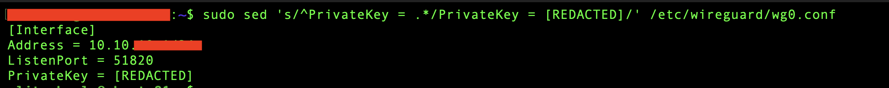
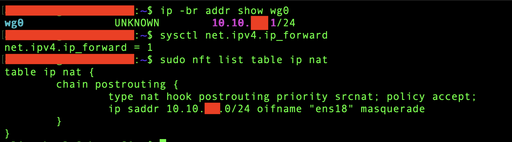
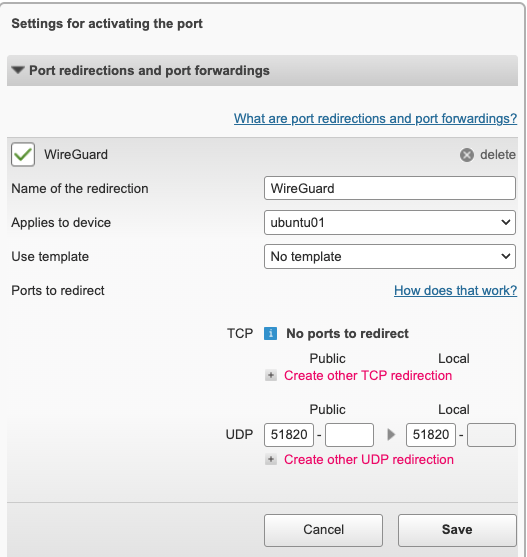
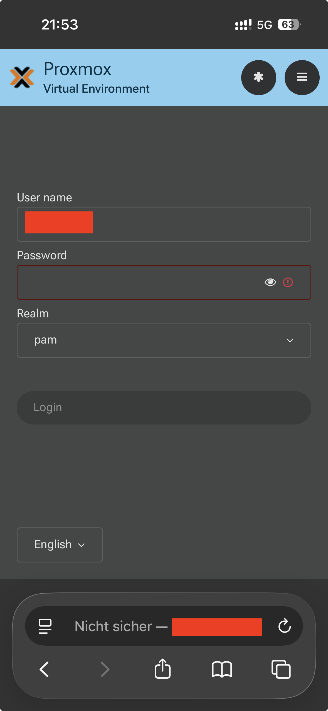
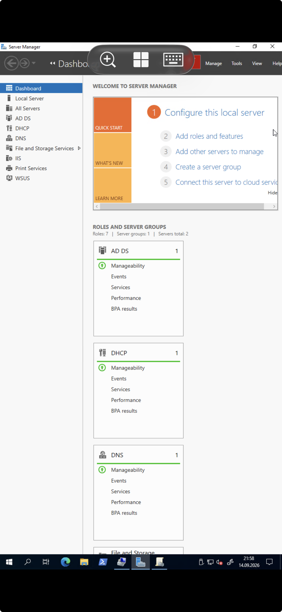

# Phase 8 – WireGuard VPN & Secure Remote Access

> **Status:** ✅ Completed

---

## Purpose & Objectives

The goal of this phase was to create secure remote access to the HomeLab without exposing internal management services directly to the Internet.

WireGuard was installed on `ubuntu01`, which is used as the VPN gateway between remote clients and the HomeLab LAN.

The main objectives were:

- Install and configure WireGuard on Ubuntu Server.
- Create a separate VPN subnet for remote clients.
- Configure IP forwarding and NAT between the VPN and HomeLab networks.
- Forward only the WireGuard UDP port on the Internet router.
- Configure an iPhone as the first remote VPN client.
- Test remote access to Proxmox and Windows Server.
- Make the VPN configuration persistent after reboot.
- Add basic nftables firewall rules.
- Configure Dynamic DNS for changing public IPv4 addresses.

---

## Environment

| Component | Detail |
|:---|:---|
| **VPN Server** | `ubuntu01` |
| **LAN Interface** | `ens18` |
| **VPN Interface** | `wg0` |
| **HomeLab LAN** | `192.168.x.0/24` |
| **WireGuard Network** | `10.10.x.0/24` |
| **WireGuard Server IP** | `10.10.x.1/24` |
| **Router** | Telekom Speedport Smart 3 |
| **VPN Protocol** | WireGuard / UDP |
| **VPN Port** | `51820/UDP` |
| **Test Client** | iPhone 15 |
| **External Test Network** | 5G mobile data |

*(Note: Public WAN addresses, real DDNS hostnames, private keys, credentials, and exact internal addressing details are not published in this repository for security reasons.)*

---

## Architecture

The Ubuntu Server works as the WireGuard endpoint and forwards VPN traffic to the HomeLab LAN.

```text
Remote Client
     |
     | WireGuard VPN
     | UDP 51820
     v
Internet
     |
     v
Speedport Router
     |
     | Port Forwarding
     v
ubuntu01
+-------------------------+
| wg0: VPN Network        |
| ens18: HomeLab LAN      |
| IP Forwarding           |
| nftables                |
| NAT / Masquerade        |
+-------------------------+
     |
     v
HomeLab LAN
192.168.x.0/24
     |
     +--> Proxmox
     +--> Windows Server
     +--> Windows Client
     +--> Other internal services
```

Only the WireGuard UDP port is forwarded from the Internet.

RDP, SSH, Proxmox Web UI, and other management services are not exposed directly to the Internet.

---

## 1. Preparation and Network Check

Before installing WireGuard, I reviewed the current network configuration of `ubuntu01`.

The server was connected to the HomeLab LAN through `ens18` with a static IPv4 address and the home router as the default gateway.

I also checked that:

- IPv4 forwarding was disabled.
- WireGuard was not installed.
- The router had a public IPv4 address.
- UDP port forwarding to `ubuntu01` was supported.
- Dynamic DNS was available on the router.

This gave me a clear starting point before the VPN configuration.

---

## 2. WireGuard Installation & Key Pair

The APT package index was updated and WireGuard was installed:

```bash
sudo apt install wireguard
```

I verified the installation with the `wg` command.

A dedicated WireGuard key pair was then created for `ubuntu01`.

The keys are stored under:

```text
/etc/wireguard/
```

The server private key was protected with `600` permissions so that only the `root` user can read or modify it.

| WireGuard Key Permissions |
|:-------------------------:|
|  |

Private key values are not published in this repository.

---

## 3. VPN Address Plan & Server Configuration

A separate subnet was selected for WireGuard clients:

- `192.168.x.0/24` – Existing HomeLab LAN
- `10.10.x.0/24` – WireGuard VPN network
- `10.10.x.1` – WireGuard server
- `10.10.x.2` – First VPN client

Using a separate VPN subnet makes it easier to understand which traffic comes from remote VPN clients.

The server configuration was created in:

```text
/etc/wireguard/wg0.conf
```

The file was protected with `600` permissions because it contains the server private key.

The WireGuard interface was started with:

```bash
sudo wg-quick up wg0
```

After startup, I verified that `wg0` received the expected VPN address and that the server was listening on UDP port `51820`.

| WireGuard Config File | Interface & Port Verification |
|:---------------------:|:-----------------------------:|
|  |  |

---

## 4. IPv4 Forwarding & NAT (Masquerade)

The WireGuard server must forward traffic between the VPN interface and the HomeLab LAN.

IPv4 forwarding was enabled permanently in:

```text
/etc/sysctl.d/99-wireguard.conf
```

The configuration contains:

```text
net.ipv4.ip_forward=1
```

### NAT Design

I used NAT/Masquerade instead of adding a static route for the WireGuard subnet to the home router and internal devices.

This keeps the existing HomeLab network unchanged.

With this setup, VPN traffic is forwarded through `ubuntu01`, and internal devices can send their replies back without needing an additional route for the VPN subnet.

A NAT table and postrouting chain were configured with `nftables`.

The masquerade rule translates traffic from the WireGuard subnet when it leaves through the LAN interface `ens18`.

| IP Forwarding & nftables NAT |
|:----------------------------:|
|  |

---

## 5. Router Port Forwarding & Mobile Client Configuration

After confirming that WireGuard was listening on UDP port `51820`, I enabled the port forwarding rule on the Speedport router.

The router forwards only the WireGuard UDP port to `ubuntu01`.

| Router Port Forwarding |
|:----------------------:|
|  |

An iPhone 15 was used as the first external WireGuard client.

The client key pair was generated directly on the iPhone so that the private key stays on the device.

Only the iPhone public key was added to the WireGuard server configuration.

A **split-tunnel** setup was used.

Only the HomeLab and WireGuard networks use the VPN tunnel:

```text
192.168.x.0/24
10.10.x.0/24
```

Normal Internet traffic continues through the client's current Internet connection.

---

## 6. External VPN Testing

The iPhone was disconnected from the home Wi-Fi and connected through 5G mobile data.

After enabling the WireGuard tunnel, the server showed a successful handshake.

### HomeLab Access Through WireGuard

After the VPN connection was established, I tested access to internal HomeLab systems.

The Proxmox Web Interface was successfully reached from the iPhone.

Remote Desktop access to a Windows Server inside the HomeLab was also tested successfully.

| External Proxmox Access (5G) | External RDP Access |
|:----------------------------:|:-------------------:|
|  |  |

These tests showed that the VPN connection could be used for normal remote administration of the HomeLab.

---

## 7. Persistent Configuration & Firewall

The VPN configuration was prepared to survive a system reboot.

- The `wg0` interface was enabled as a systemd service:

```bash
sudo systemctl enable wg-quick@wg0
```

- IPv4 forwarding was stored in the sysctl configuration.
- The NAT configuration was stored in `/etc/nftables.conf`.
- The `nftables` service was enabled.

After rebooting `ubuntu01`, I verified that the WireGuard interface, IPv4 forwarding, and NAT configuration were restored automatically.

### Basic Firewall Rules

After confirming that the VPN was working, I added basic `nftables` filtering rules.

The `input` and `forward` chains use a default `drop` policy.

The server allows the traffic required for this setup.

**Input traffic:**

- Established and related connections
- Loopback traffic
- SSH from the HomeLab LAN
- SSH from the WireGuard VPN subnet
- UDP port `51820`
- ICMP traffic for troubleshooting

**Forwarded traffic:**

- Established and related connections
- Traffic from the WireGuard VPN subnet to the HomeLab LAN

Outbound traffic from `ubuntu01` remains allowed.

After applying the firewall rules, I tested the important connections again.

A new SSH connection from the HomeLab LAN worked, the WireGuard tunnel remained active, and the iPhone could still access Proxmox through 5G.

---

## 8. Dynamic DNS (DDNS)

The public IPv4 address of the Internet connection can change.

Dynamic DNS was configured on the Speedport router so that the WireGuard clients can use a hostname instead of a fixed public IP address.

The WireGuard endpoint now uses a hostname similar to:

```text
vpn.example.net:51820
```

The real DDNS hostname is not published.

### DDNS Verification

To test the configuration, I changed the router's public IPv4 address.

I then checked the DDNS hostname with:

```bash
nslookup vpn.example.net
```

The hostname resolved to the new public IP address.

After restarting the WireGuard tunnel on the iPhone, the VPN connection worked again without entering the new public IP manually.

This showed that the DDNS configuration was working as expected.

---

## Troubleshooting

### Speedport Single-Port Forwarding

The first router configuration used the same port number in both fields of the port range.

The Speedport Smart 3 rejected this configuration.

For a single port, only the first field is required.

```text
UDP 51820
```

The second field is only needed when configuring a port range.

### WireGuard Handshake Test

During the first external test, enabling the tunnel did not immediately show a WireGuard handshake.

I used `tcpdump` on `ens18` to check whether UDP packets were reaching `ubuntu01`:

```bash
sudo tcpdump -ni ens18 udp port 51820
```

After generating traffic from the iPhone, the packets were visible.

This showed that the router and port forwarding were working, so I could continue checking the WireGuard configuration.

### Dynamic DNS After Public IP Change

After changing the router's public IP, the DDNS hostname correctly resolved to the new address.

The iPhone WireGuard client first continued to use the previous resolved endpoint.

After restarting the WireGuard tunnel, the hostname was resolved again and the VPN connection worked.

---

## Real-World Scenario

This setup provides one VPN entry point for remote HomeLab administration.

Instead of exposing services such as RDP, SSH, or the Proxmox Web UI directly to the Internet, only the WireGuard UDP port is forwarded.

After connecting to the VPN, the internal HomeLab systems can be reached through their private network addresses.

This is a common approach for remote access to a small internal network.

---

## Lessons Learned

1. **WireGuard and routing:** WireGuard creates the VPN tunnel, but routing must be configured separately.

2. **IPv4 forwarding:** This allows `ubuntu01` to forward traffic between `wg0` and the HomeLab LAN.

3. **NAT/Masquerade:** This avoids adding a return route for the VPN subnet to every internal device.

4. **Key management:** A VPN client can generate its own private key so that the private key stays on the client device.

5. **Port forwarding:** Only the VPN service needs to be exposed through the Internet router.

6. **Firewall rules:** Required SSH, VPN, and forwarding traffic should be allowed before changing the default policy to `drop`.

7. **Dynamic DNS:** DDNS provides a stable hostname when the public Internet address changes.

8. **Reboot test:** A reboot test is important to check that WireGuard, forwarding, and NAT settings are persistent.

---

## Result

WireGuard now provides remote access to the HomeLab.

The final setup includes:

- A separate WireGuard VPN subnet.
- Public/private key authentication.
- UDP port forwarding through the Speedport router.
- IPv4 forwarding between the VPN and HomeLab LAN.
- nftables NAT/Masquerade.
- Basic nftables firewall filtering.
- Automatic WireGuard and nftables startup.
- Dynamic DNS for changing public IP addresses.
- External testing through a 5G connection.
- Successful Proxmox and Windows remote access tests.

The HomeLab can now be accessed remotely through WireGuard without exposing its internal management services directly to the Internet.

---

## Navigation

| Previous | Home | Next |
|:--------:|:----:|:----:|
| ⬅️ [Phase 7: Linux Networking](../7-Linux-Networking/README.md) | 🏠 [Home](../../README.md) | ➡️ Phase 9: Active Directory Integration *(Coming Soon)* |
