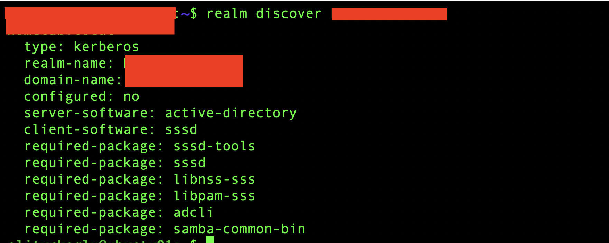
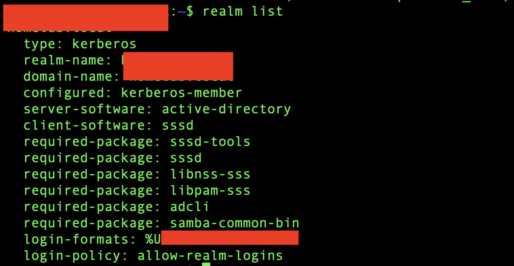
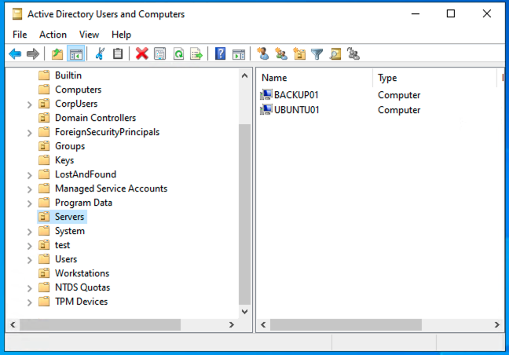
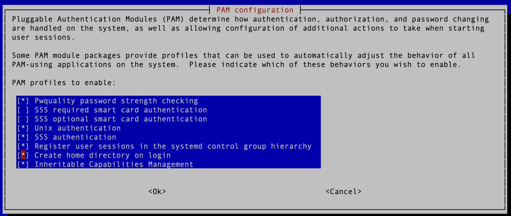
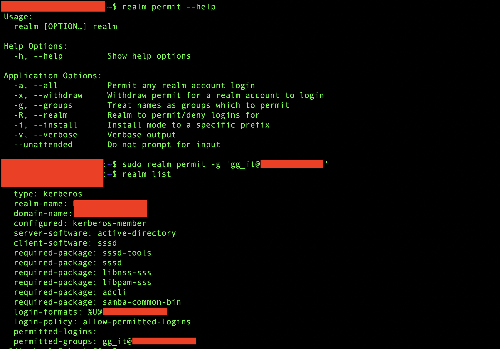

# Phase 9 – Active Directory Integration & Centralized Authentication

> **Status:** ✅ Completed

---

## Purpose & Objectives

The goal of this phase was to integrate the Ubuntu Server with the existing Active Directory environment and manage Linux user access through centralized AD accounts and groups.

Instead of creating separate Linux accounts for every user, the server can now use existing Active Directory identities through SSSD.

The main objectives were:
- Verify DNS and time requirements before the domain join.
- Discover the existing Active Directory domain from Ubuntu.
- Join `ubuntu01` to Active Directory.
- Verify AD user and group resolution through SSSD.
- Configure automatic home directory creation for AD users.
- Restrict Linux login access to an existing AD security group.
- Test allowed and denied AD user logins.
- Verify that the configuration remains active after reboot.

---

## Environment

| Component | Detail |
|:---|:---|
| **Linux Server** | Ubuntu Server (`ubuntu01`) |
| **Identity Service** | Microsoft Active Directory |
| **DNS** | Internal Active Directory DNS |
| **Domain Integration** | `realmd` |
| **Linux Identity Client** | SSSD |
| **Authentication** | Kerberos / PAM |
| **Access Group** | `GG_IT` |
| **Virtualization** | Proxmox VE |

*(Note: Internal domain names, IP addresses, account details, and other sensitive information are not published in this repository for security reasons).*

---

## Architecture

The Ubuntu Server was connected to the existing Active Directory environment instead of using separate local Linux accounts for domain users.

```text
Active Directory
      |
      | DNS / Kerberos
      v
   ubuntu01
+-----------------------+
| realmd                |
| SSSD                  |
| PAM                   |
| NSS                   |
+-----------------------+
      |
      +--> AD user resolution
      +--> AD group resolution
      +--> User authentication
      +--> Group-based access
```

`realmd` was used for domain discovery and joining, while SSSD provides access to Active Directory users and groups on Linux.

---

## 1. DNS and Domain Preparation

Before joining the domain, I verified the Ubuntu network configuration, time synchronization, and Active Directory DNS resolution.

The internal AD domain was also added as a DNS search domain in Netplan. This allowed the Ubuntu Server to resolve the domain controller and required Active Directory DNS records correctly.

This was important because Active Directory and Kerberos depend on correct DNS resolution and synchronized system time.

---

## 2. Active Directory Integration Packages

The required Linux components were installed before joining the domain.

The main packages included:
- `realmd` – domain discovery and domain join
- `sssd-ad` – Active Directory support for SSSD
- `sssd-tools` – SSSD management tools
- `adcli` – Active Directory command-line integration
- `krb5-user` – Kerberos authentication tools
- `libnss-sss` – AD user and group resolution through NSS
- `libpam-sss` – SSSD integration with PAM

These components connect Linux identity and authentication services with Active Directory.

---

## 3. Active Directory Domain Discovery & Join

Before the domain join, I used `realmd` to discover the internal Active Directory domain:

```bash
realm discover <internal-domain>
```

Ubuntu detected the Active Directory environment, Kerberos realm, and SSSD client configuration successfully.

Then, the Ubuntu Server was joined to Active Directory with:

```bash
sudo realm join <internal-domain> -U <ad-user>
```

After the join, I verified the domain configuration with:

```bash
realm list
```

The server was reported as a Kerberos domain member and SSSD was selected as the Linux client software.

| AD Domain Discovery | AD Domain Join Verification |
|:-------------------:|:---------------------------:|
|  |  |

The domain join also created a computer account for `UBUNTU01` in Active Directory. I moved this computer object to the existing `Servers` OU to keep the directory structure organized.

| Ubuntu01 AD Computer Object |
|:---------------------------:|
|  |

---

## 4. AD User and Group Resolution

After the domain join, I verified that Ubuntu could resolve Active Directory users and groups through SSSD.

Tests with `id` and `getent` confirmed that Linux could retrieve:
- AD user identity information
- Linux UID and GID values
- AD group memberships
- User shell and home directory information

For example:

```bash
id '<ad-user>@<internal-domain>'
getent passwd '<ad-user>@<internal-domain>'
```

No separate local Linux account was required for the AD user.

---

## 5. AD Login and Home Directory Creation

The first AD authentication test was successful, but the user's home directory did not exist yet.

PAM was updated to enable automatic home directory creation:

```bash
sudo pam-auth-update
```

The **Create home directory on login** option was enabled.

| PAM Configuration – Home Directory |
|:----------------------------------:|
|  |

After this change, the AD user logged in successfully and received a home directory automatically during the first login.

This allows AD users to receive a normal Linux user environment without manually creating home directories.

---

## 6. Centralized Access Control with an AD Group

After the domain join, the default configuration allowed domain users to log in.

For this HomeLab, Linux access was restricted to the existing `GG_IT` Active Directory security group.

I first reviewed the available `realm permit` options and then applied the group-based policy:

```bash
sudo realm permit -g 'gg_it@<internal-domain>'
```

The resulting configuration was verified with:

```bash
realm list
```

The login policy changed to allow only permitted accounts, and `GG_IT` became the permitted Active Directory group.

| AD Group Access Policy |
|:----------------------:|
|  |

This allows Linux access to be managed centrally from Active Directory instead of managing individual Linux accounts.

---

## 7. Access Control Testing

The access policy was tested with two Active Directory users:

1. A user who was a member of `GG_IT` logged in successfully.
2. A user who was not a member of `GG_IT` was denied access.

This confirmed that Linux login access could be controlled through Active Directory group membership.

Access can now be changed centrally by adding or removing users from the AD security group.

---

## 8. Reboot and Persistence Test

After completing the configuration, `ubuntu01` was rebooted.

The following items were checked again:
- Active Directory domain membership
- SSSD service status
- AD user resolution
- AD group membership
- `GG_IT` login policy
- AD user login

All configuration and authentication functions remained active after the reboot.

---

## Troubleshooting

### AD User Home Directory Was Missing

AD authentication worked during the first login test, but Linux could not open the user's home directory because it did not exist yet.

Automatic home directory creation was enabled through PAM using:

```bash
sudo pam-auth-update
```

After enabling **Create home directory on login**, the login test was repeated successfully and the user's home directory was created automatically.

---

## Real-World Scenario

In a company environment, Linux servers do not always need separate local accounts for every administrator.

By integrating the server with Active Directory, existing company identities can also be used for Linux systems.

In this HomeLab, membership in the `GG_IT` Active Directory group controls who is allowed to log in to the Ubuntu Server. User access can therefore be managed centrally from Active Directory.

---

## Lessons Learned

1. **DNS is critical for Active Directory integration:** The Linux server must be able to resolve the domain controller and Active Directory DNS records correctly.
2. **System time is important for Kerberos:** Authentication depends on synchronized clocks between systems.
3. **realmd simplifies domain integration:** It can discover the AD environment and configure the Linux system as a domain member.
4. **SSSD connects Linux identities with Active Directory:** AD users and groups can be used without creating separate local accounts.
5. **PAM manages the Linux login process:** Automatic home directory creation can be added to the AD login process.
6. **AD groups can control Linux access:** The `GG_IT` group provides centralized group-based access control for the Ubuntu Server.
7. **Positive and negative tests are both useful:** Testing one permitted and one non-permitted user confirmed that the access policy worked correctly.
8. **Reboot testing verifies persistence:** The domain membership, SSSD service, and access policy remained active after restart.

---

## Result

`ubuntu01` is now integrated with the existing Active Directory environment.

The server can resolve and authenticate AD users through SSSD, create home directories automatically, and control Linux login access through the existing `GG_IT` security group.

This connects the Linux server to the same centralized identity environment already used by the Windows infrastructure.

---

## Navigation

| Previous | Home | Next |
|:--------:|:----:|:----:|
| ⬅️ [Phase 8: WireGuard VPN & Secure Remote Access](../8-WireGuard-VPN-Secure-Remote-Access/README.md) | 🏠 [Home](../../README.md) | ➡️ Phase 10: Linux Security & Hardening *(Coming Soon)* |
